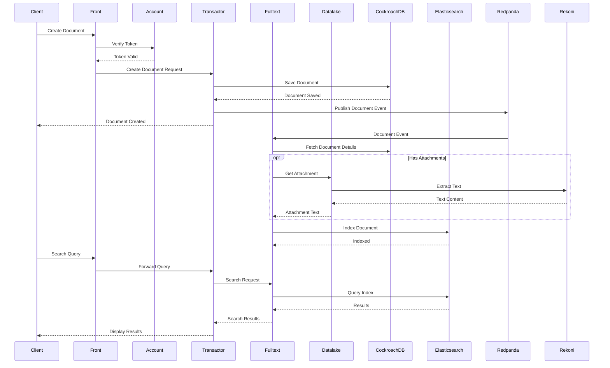
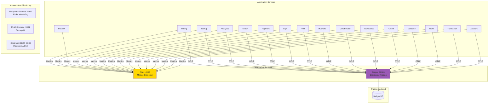

# Huly Platform Architecture Overview

## Service Overview

The Huly platform consists of **30+ microservices** working together in a distributed architecture. Services are organized into functional layers for core business logic, data storage, real-time communication, media processing, and supporting features.

### Core Backend Services

| Service | Port | Description |
|---------|------|-------------|
| **account** | 3000 | Authentication and user management. Handles login, registration, JWT tokens, workspace membership, and user permissions. |
| **transactor** | 3332 | Core transaction processing engine. Maintains WebSocket connections for real-time updates, processes all data mutations, enforces business logic, and publishes events to the message queue. |
| **workspace** | - | Workspace lifecycle management. Handles workspace creation, initialization, upgrades, and maintenance background jobs. |
| **stats** | 4900 | Metrics collection and aggregation. Collects usage statistics and health metrics from all services for monitoring. |

### Storage & Data Services

| Service | Port | Description |
|---------|------|-------------|
| **datalake** | 4030 | Blob storage management with metadata. Handles file uploads, permissions, and coordinates with MinIO for object storage. |
| **hulylake** | 8096 | Storage adapter API. Provides S3-compatible interface for accessing stored objects. |
| **hulykvs** | 8094 | Key-value store service. Fast storage for configuration, preferences, and cached data. |

### Search & Indexing

| Service | Port | Description |
|---------|------|-------------|
| **fulltext** | 4702 | Full-text search indexing. Consumes events, extracts content, maintains Elasticsearch index for fast searches. |
| **rekoni** | 4004 | Document intelligence service. Extracts text and structured data from binary documents (PDF, DOC, DOCX, RTF, HTML) for searchability and resume parsing. Supports HeadHunter, LinkedIn, and generic resume formats. |

### Real-time Services

| Service | Port | Description |
|---------|------|-------------|
| **collaborator** | 3078 | Real-time document collaboration using Y.js CRDT. Enables simultaneous editing with conflict resolution. |
| **hulypulse** | 8099 | WebSocket notification server. Handles real-time push notifications to connected clients. |
| **hulygun** | - | Event processor. Consumes and processes events from Redpanda for real-time updates. |

### Media Services

| Service | Port | Description |
|---------|------|-------------|
| **stream** | 1080 | Video streaming service with HLS transcoding for recording playback. |
| **media** | - | Media processing queue. Handles video/audio conversion and optimization. |
| **preview** | 4040 | Thumbnail and preview generation for images and documents. |

### Feature Services

| Service | Port | Description |
|---------|------|-------------|
| **print** | 4005 | PDF generation service for printing documents and reports. |
| **sign** | 4006 | Digital signature service for document signing with certificates. |
| **payment** | 3040 | Payment and billing integration (Polar). Handles subscriptions and payments. |
| **export** | 4009 | Data export service for workspace backups and data extraction. |
| **analytics** | 4017 | Analytics event collection and processing. |
| **process** | - | Workflow automation and process orchestration. |
| **rating** | - | Content rating and quality metrics. |

### Backup Services

| Service | Port | Description |
|---------|------|-------------|
| **backup** | - | Automated backup service. Periodically backs up workspace data to object storage. |
| **backup-api** | 4039 | Backup REST API. Provides endpoints for backup management and restoration. |

### Frontend

| Service | Port | Description |
|---------|------|-------------|
| **front** | 8087/8088 | Web application server. Serves the Huly UI, handles static assets and client-side routing. |

### Infrastructure (Databases & Message Queues)

| Service | Port(s) | Description |
|---------|---------|-------------|
| **cockroach** | 26257, 8089 | **CockroachDB - Primary Application Database**. Stores ALL business data: users, workspaces, documents, transactions, metadata, permissions. Distributed SQL with ACID guarantees. |
| **elastic** | 9200 | Elasticsearch search engine. Stores full-text search indexes managed by fulltext service. |
| **minio** | 9000, 9001 | S3-compatible object storage. Stores binary files, attachments, images, and blobs in buckets (blobs, eu, backups). |
| **redpanda** | 9092, 19092 | Kafka-compatible event streaming. Provides reliable async messaging between services. |
| **redis** | 6379 | In-memory cache and pub/sub. Used by HulyPulse for real-time notifications. |

### Monitoring & Observability

| Service | Port | Description |
|---------|------|-------------|
| **jaeger** | 16686, 4318 | Distributed tracing UI and OTLP collector. All services send traces for performance monitoring. |
| **redpanda_console** | 8000 | Kafka management UI for monitoring topics, consumers, and message flow. |

### Service Communication Patterns

- **Synchronous (HTTP/WebSocket)**: Client ↔ Front ↔ Backend Services
- **Asynchronous (Events)**: Producers (Transactor, Workspace) → Redpanda → Consumers (Fulltext, Media, Process)
- **Primary Database**: All services → CockroachDB (main application data)
- **Search Index**: Fulltext → Elasticsearch
- **Object Storage**: Services → MinIO (S3 API)
- **Cache/Pub-Sub**: HulyPulse → Redis
- **Real-time Updates**: Client ↔ Transactor (WebSocket), Client ↔ Collaborator (WebSocket)

---

## 1. High-Level System Architecture

```mermaid
graph TB
    subgraph "Client Layer"
        Browser[Web Browser]
        Desktop[Desktop App]
    end
    
    subgraph "Frontend"
        Front[Front Server<br/>:8087]
    end
    
    subgraph "Core Backend Services"
        Account[Account<br/>:3000<br/>Auth & Users]
        Workspace[Workspace<br/>Management]
        Transactor[Transactor<br/>:3332<br/>Transactions]
        Stats[Stats<br/>:4900<br/>Metrics]
    end
    
    subgraph "Storage Services"
        Datalake[Datalake<br/>:4030<br/>Blob Storage]
        Hulylake[Hulylake<br/>:8096<br/>Storage API]
        HulyKVS[HulyKVS<br/>:8094<br/>Key-Value]
    end
    
    subgraph "Search & Indexing"
        Fulltext[Fulltext<br/>:4702<br/>Search]
        Rekoni[Rekoni<br/>:4004<br/>Doc Intelligence]
    end
    
    subgraph "Real-time"
        Collaborator[Collaborator<br/>:3078<br/>Doc Sync]
        Pulse[HulyPulse<br/>:8099<br/>WebSocket]
        Gun[HulyGun<br/>Events]
    end
    
    subgraph "Media"
        Stream[Stream<br/>:1080<br/>Video]
        Media[Media<br/>Processing]
        Preview[Preview<br/>:4040<br/>Thumbnails]
    end
    
    subgraph "Feature Services"
        Print[Print<br/>:4005]
        Sign[Sign<br/>:4006]
        Payment[Payment<br/>:3040]
        Export[Export<br/>:4009]
        Analytics[Analytics<br/>:4017]
        Process[Process<br/>Automation]
        Rating[Rating<br/>Metrics]
    end
    
    subgraph "Backup"
        Backup[Backup<br/>Service]
        BackupAPI[Backup API<br/>:4039]
    end
    
    subgraph "Primary Database"
        CockroachDB[(CockroachDB<br/>:26257<br/>Main Application DB)]
    end
    
    subgraph "Supporting Infrastructure"
        Elasticsearch[(Elasticsearch<br/>:9200)]
        Minio[(MinIO<br/>:9000)]
        Redpanda[Redpanda<br/>:9092<br/>Kafka]
        Redis[(Redis<br/>:6379)]
    end
    
    Browser --> Front
    Desktop --> Front
    
    Front --> Account
    Front --> Transactor
    Front --> Collaborator
    Front --> Datalake
    Front --> Pulse
    
    Account --> CockroachDB
    Workspace --> CockroachDB
    Transactor --> CockroachDB
    Transactor --> Redpanda
    Transactor --> Fulltext
    
    Datalake --> CockroachDB
    Datalake --> Minio
    Hulylake --> CockroachDB
    Hulylake --> Minio
    HulyKVS --> CockroachDB
    
    Fulltext --> Elasticsearch
    Fulltext --> CockroachDB
    Fulltext --> Rekoni
    Fulltext --> Redpanda
    
    Pulse --> Redis
    Gun --> Redpanda
    
    Stream --> Datalake
    Media --> Redpanda
    Preview --> Datalake
    
    style Front fill:#4A90E2
    style Account fill:#E24A4A
    style Transactor fill:#E24A4A
    style CockroachDB fill:#7ED321
    style Redpanda fill:#F5A623
```

---

## 2. Port Mapping & Service Access


---

## 3. Event-Driven Architecture (Redpanda/Kafka)

```mermaid
graph LR
    subgraph "Event Producers"
        Transactor[Transactor<br/>Transactions]
        Workspace[Workspace<br/>Workspaces]
        Rating[Rating<br/>Ratings]
    end
    
    subgraph "Event Bus"
        Redpanda[Redpanda<br/>Kafka Topics<br/>:9092]
    end
    
    subgraph "Event Consumers"
        Fulltext[Fulltext<br/>Search Indexing]
        Media[Media<br/>Processing]
        Process[Process<br/>Automation]
        Gun[HulyGun<br/>Event Processor]
        Backup[Backup<br/>Archival]
    end
    
    subgraph "Queue Configuration"
        QC[QUEUE_CONFIG<br/>cockroach|http://redpanda:9092<br/>Region-based routing]
    end
    
    Transactor -->|Document Events| Redpanda
    Transactor -->|User Actions| Redpanda
    Workspace -->|Workspace Events| Redpanda
    Rating -->|Rating Events| Redpanda
    
    Redpanda -->|Index Events| Fulltext
    Redpanda -->|Media Events| Media
    Redpanda -->|Process Events| Process
    Redpanda -->|All Events| Gun
    Redpanda -->|Backup Events| Backup
    
    QC -.Config.-> Transactor
    QC -.Config.-> Workspace
    QC -.Config.-> Fulltext
    QC -.Config.-> Media
    QC -.Config.-> Process
    QC -.Config.-> Backup
    
    style Redpanda fill:#F5A623
    style Transactor fill:#E24A4A
```

---

## 4. Complete Service Dependency Map

```mermaid
graph TB
    subgraph "Client"
        Client[Browser/Desktop]
    end
    
    subgraph "Frontend"
        Front[Front :8087]
    end
    
    subgraph "Core Backend"
        Account[Account :3000]
        Transactor[Transactor :3332]
        Workspace[Workspace]
        Stats[Stats :4900]
    end
    
    subgraph "Storage Layer"
        Datalake[Datalake :4030]
        Hulylake[Hulylake :8096]
        HulyKVS[HulyKVS :8094]
    end
    
    subgraph "Search Layer"
        Fulltext[Fulltext :4702]
        Rekoni[Rekoni :4004]
    end
    
    subgraph "Real-time Layer"
        Collaborator[Collaborator :3078]
        Pulse[HulyPulse :8099]
        Gun[HulyGun]
    end
    
    subgraph "Media Layer"
        Stream[Stream :1080]
        Media[Media]
        Preview[Preview :4040]
    end
    
    subgraph "Feature Layer"
        Print[Print :4005]
        Sign[Sign :4006]
        Payment[Payment :3040]
        Export[Export :4009]
        Analytics[Analytics :4017]
        Process[Process]
        Rating[Rating]
    end
    
    subgraph "Backup Layer"
        Backup[Backup]
        BackupAPI[Backup API :4039]
    end
    
    subgraph "Primary Database"
        CockroachDB[(CockroachDB :26257<br/>ALL APPLICATION DATA)]
    end
    
    subgraph "Infrastructure"
        Elasticsearch[(Elasticsearch :9200)]
        Minio[(MinIO :9000)]
        Redpanda[Redpanda :9092]
        Redis[(Redis :6379)]
        Jaeger[Jaeger :16686]
    end
    
    Client --> Front
    
    Front --> Account
    Front --> Transactor
    Front --> Collaborator
    Front --> Datalake
    Front --> Hulylake
    Front --> Pulse
    Front --> Payment
    Front --> Preview
    Front --> Stream
    
    Account --> CockroachDB
    Transactor --> CockroachDB
    Transactor --> Redpanda
    Transactor --> Fulltext
    Workspace --> CockroachDB
    Workspace --> Redpanda
    Workspace --> Minio
    
    Datalake --> CockroachDB
    Datalake --> Minio
    Hulylake --> CockroachDB
    Hulylake --> Minio
    HulyKVS --> CockroachDB
    
    Fulltext --> Elasticsearch
    Fulltext --> CockroachDB
    Fulltext --> Rekoni
    Fulltext --> Redpanda
    Rekoni --> Jaeger
    
    Collaborator --> Datalake
    Pulse --> Redis
    Gun --> Redpanda
    Gun --> Account
    
    Stream --> Datalake
    Stream --> Redpanda
    Media --> Redpanda
    Preview --> Datalake
    
    Print --> CockroachDB
    Print --> Minio
    Sign --> CockroachDB
    Sign --> Minio
    Export --> CockroachDB
    Export --> Minio
    Analytics --> Account
    Process --> Redpanda
    Rating --> CockroachDB
    Rating --> Redpanda
    
    Backup --> CockroachDB
    Backup --> Minio
    BackupAPI --> Minio
    
    Account --> Redpanda
    Account --> Jaeger
    Transactor --> Jaeger
    Datalake --> Jaeger
    
    style CockroachDB fill:#7ED321
    style Redpanda fill:#F5A623
    style Front fill:#4A90E2
    style Transactor fill:#E24A4A
    style Account fill:#E24A4A
```

---

## 5. Storage Architecture


---

## 6. Authentication & Authorization Flow


---

## 7. Data Flow - Document Creation & Search



---

## 8. Infrastructure Dependencies

```mermaid
graph TB
    subgraph "Services Using CockroachDB (Primary DB)"
        Account[Account]
        Workspace[Workspace]
        Transactor[Transactor]
        Datalake[Datalake]
        Hulylake[Hulylake]
        HulyKVS[HulyKVS]
        Fulltext[Fulltext]
        Backup[Backup]
        Rating[Rating]
        Export[Export]
        Print[Print]
        Sign[Sign]
    end
    
    subgraph "Services Using Elasticsearch"
        FT[Fulltext]
    end
    
    subgraph "Services Using MinIO (Object Storage)"
        DL[Datalake]
        HL[Hulylake]
        BK[Backup]
        ST[Stream]
        PR[Preview]
        WS[Workspace]
        EX[Export]
        PT[Print]
        SN[Sign]
        MD[Media]
    end
    
    subgraph "Services Using Redpanda (Event Queue)"
        TR[Transactor]
        WSP[Workspace]
        FTS[Fulltext]
        MED[Media]
        PS[Process]
        GUN[HulyGun]
        RT[Rating]
        BKP[Backup]
        STR[Stream]
        ACC[Account]
    end
    
    subgraph "Services Using Redis"
        Pulse[HulyPulse]
    end
    
    subgraph "Primary Database"
        CockroachDB[(CockroachDB :26257)]
    end
    
    subgraph "Infrastructure"
        ES[(Elasticsearch :9200)]
        Minio[(MinIO :9000)]
        RP[Redpanda :9092]
        Redis[(Redis :6379)]
    end
    
    Account --> CockroachDB
    Workspace --> CockroachDB
    Transactor --> CockroachDB
    Datalake --> CockroachDB
    Hulylake --> CockroachDB
    HulyKVS --> CockroachDB
    Fulltext --> CockroachDB
    Backup --> CockroachDB
    Rating --> CockroachDB
    Export --> CockroachDB
    Print --> CockroachDB
    Sign --> CockroachDB
    
    FT --> ES
    
    DL --> Minio
    HL --> Minio
    BK --> Minio
    ST --> Minio
    PR --> Minio
    WS --> Minio
    EX --> Minio
    PT --> Minio
    SN --> Minio
    MD --> Minio
    
    TR --> RP
    WSP --> RP
    FTS --> RP
    MED --> RP
    PS --> RP
    GUN --> RP
    RT --> RP
    BKP --> RP
    STR --> RP
    ACC --> RP
    
    Pulse --> Redis
    
    style CockroachDB fill:#7ED321
    style ES fill:#FFD700
    style Minio fill:#C92A2A
    style RP fill:#F5A623
    style Redis fill:#DC382D
```



---

## 9. Observability & Monitoring Stack



---

## Service Summary Table

| Service | Container | Port | Purpose | Dependencies |
|---------|-----------|------|---------|--------------|
| **Frontend** | | | | |
| front | hardcoreeng/front | 8087/8088 | Web application server | account, transactor, collaborator, datalake |
| **Core** | | | | |
| account | hardcoreeng/account | 3000 | Authentication & user management | cockroach, redpanda, stats |
| transactor | hardcoreeng/transactor | 3332 | Transaction processing (WebSocket) | cockroach, redpanda, fulltext, account |
| workspace | hardcoreeng/workspace | - | Workspace management | cockroach, redpanda, minio, account |
| stats | hardcoreeng/stats | 4900 | Metrics collection | - |
| **Storage** | | | | |
| datalake | hardcoreeng/datalake | 4030 | Blob storage & metadata | cockroach, minio, account |
| hulylake | hardcoreeng/hulylake | 8096 | Storage adapter API | cockroach, minio |
| hulykvs | hardcoreeng/hulykvs | 8094 | Key-value store | cockroach |
| **Search** | | | | |
| fulltext | hardcoreeng/fulltext | 4702 | Full-text search indexing | elasticsearch, cockroach, rekoni, redpanda |
| rekoni | hardcoreeng/rekoni-service | 4004 | Document intelligence | stats |
| **Real-time** | | | | |
| collaborator | hardcoreeng/collaborator | 3078 | Real-time document collaboration | account, datalake, transactor |
| hulypulse | hardcoreeng/hulypulse | 8099 | WebSocket notifications | redis |
| hulygun | hardcoreeng/hulygun | - | Event processor | redpanda, account |
| **Media** | | | | |
| stream | hardcoreeng/stream | 1080 | Video streaming | datalake, redpanda |
| media | hardcoreeng/media | - | Media processing | redpanda, account |
| preview | hardcoreeng/preview | 4040 | Thumbnail generation | datalake |
| **Features** | | | | |
| print | hardcoreeng/print | 4005 | PDF generation | cockroach, minio, account |
| sign | hardcoreeng/sign | 4006 | Digital signatures | cockroach, minio, account |
| payment | hardcoreeng/payment | 3040 | Payment processing | account |
| export | hardcoreeng/export | 4009 | Data export | cockroach, minio, account |
| analytics | hardcoreeng/analytics-collector | 4017 | Analytics collection | account, stats |
| process | hardcoreeng/process | - | Workflow automation | redpanda, account |
| rating | hardcoreeng/rating | - | Content rating | cockroach, redpanda, account |
| **Backup** | | | | |
| backup | hardcoreeng/backup | - | Automated backup | cockroach, minio, account |
| backup-api | hardcoreeng/backup-api | 4039 | Backup REST API | minio, account |
| **Primary Database** | | | | |
| cockroach | cockroachdb/cockroach:latest-v24.3 | 26257, 8089 | **Main application database** - stores users, workspaces, documents, transactions, metadata, permissions | - |
| **Supporting Infrastructure** | | | | |
| elastic | elasticsearch:7.14.2 | 9200 | Search engine for full-text indexes | - |
| minio | minio/minio | 9000, 9001 | Object storage (S3) for files and blobs | - |
| redpanda | redpandadata/redpanda:v24.3.6 | 9092, 19092 | Event streaming (Kafka) for async processing | - |
| redis | redis:8.0.2-alpine3.21 | 6379 | Cache & pub/sub for real-time features | - |
| **Monitoring** | | | | |
| jaeger | jaegertracing/all-in-one | 16686, 4318 | Distributed tracing and performance monitoring | - |
| redpanda_console | redpandadata/console:v2.8.3 | 8000 | Kafka management UI | redpanda |

---

## Environment Variables Summary

### Common Configuration (Shared by Most Services)
- `SERVER_SECRET` / `SECRET`: `secret` - Shared authentication secret
- `REGION`: `cockroach` - Deployment region identifier
- `ACCOUNTS_URL`: `http://huly.local:3000` - Account service URL
- `STATS_URL`: `http://huly.local:4900` - Metrics collection URL
- `OTEL_EXPORTER_OTLP_ENDPOINT`: `http://jaeger:4318/v1/traces` - Tracing endpoint
- `STORAGE_CONFIG`: `${STORAGE_CONFIG}` - MinIO connection string
- `QUEUE_CONFIG`: `${QUEUE_CONFIG}` - Redpanda/Kafka configuration

### Database Configuration
- `DB_URL` / `DB_CR_URL`: CockroachDB connection string
- `FULLTEXT_DB_URL`: `http://huly.local:9200` - Elasticsearch URL
- `HULY_DB_CONNECTION`: CockroachDB connection for Huly* services

### Storage Configuration
- `STORAGE_CONFIG`: MinIO configuration (format: `minio|minio?accessKey=minioadmin&secretKey=minioadmin`)
- `AWS_ENDPOINT_URL`: `http://minio:9000` - S3-compatible endpoint
- `AWS_ACCESS_KEY_ID`: `minioadmin`
- `AWS_SECRET_ACCESS_KEY`: `minioadmin`
- `BUCKETS`: `blobs,eu|http://minio:9000?accessKey=minioadmin&secretKey=minioadmin` - Datalake bucket configuration

### Queue Configuration
- `QUEUE_CONFIG`: `cockroach|http://redpanda:9092` - Region-based event routing
- `HULY_KAFKA_BOOTSTRAP`: `redpanda:9092` - Kafka bootstrap servers

### Service URLs (Internal)
- `ACCOUNTS_URL`: `http://huly.local:3000`
- `TRANSACTOR_URL`: `ws://huly.local:3332`
- `FULLTEXT_URL`: `http://huly.local:4702`
- `REKONI_URL`: `http://huly.local:4004`
- `COLLABORATOR_URL`: `ws://huly.local:3078`
- `DATALAKE_URL`: `http://huly.local:4030`
- `HULYLAKE_URL`: `http://huly.local:8096`
- `PULSE_URL`: `ws://huly.local:8099/ws`
- `PREVIEW_URL`: `http://huly.local:4040`
- `STREAM_URL`: `http://huly.local:1080/recording`
- `PAYMENT_URL`: `http://huly.local:3040`
- `PRINT_URL`: `http://huly.local:4005`
- `SIGN_URL`: `http://huly.local:4006`
- `BACKUP_URL`: `http://huly.local:4039/api/backup`
- `AI_BOT_URL`: `http://huly.local:4010`

### Frontend Configuration
- `FILES_URL`: `http://huly.local:4030/blob/:workspace/:blobId/:filename` - File download URL pattern
- `FRONT_URL`: `http://huly.local:8087` - Frontend base URL
- `BRANDING_URL`: `http://huly.local:8087/branding.json`
- `DESKTOP_UPDATES_URL`: `https://dist.huly.io`

### Authentication & Security
- `HULY_TOKEN_SECRET`: `secret` - Token signing for Huly services
- `SERVER_SECRET`: `secret` - Service-to-service auth
- `ADMIN_EMAILS`: Admin user emails
- `LAST_NAME_FIRST`: `true` - Name formatting preference

### Feature Flags
- `COMMUNICATION_API_ENABLED`: `true`
- `COMMUNICATION_TIME_LOGGING_ENABLED`: `true`
- `ENABLE_COMPRESSION`: `true` - Transactor compression

### Rate Limiting (Transactor)
- `RATE_LIMIT_MAX`: `250` - Requests per window
- `RATE_LIMIT_WINDOW`: `30000` - 30 seconds

### Workspace Configuration
- `WS_OPERATION`: `all+backup` - Operation mode
- `WORKSPACE_LIMIT_PER_USER`: `10000`
- `REGION_INFO`: `cockroach|CockroachDB` - Available regions

### Backup Configuration
- `BUCKET_NAME`: `backups`
- `BACKUP_STORAGE`: `${BACKUP_STORAGE_CONFIG}`
- `INTERVAL`: `60` - Backup interval in seconds

### Redis Configuration (HulyPulse)
- `HULY_REDIS_URLS`: `redis://redis:6379`
- `HULY_BIND_PORT`: `8099`

### Stream Service
- `STREAM_ENDPOINT_URL`: `datalake://huly.local:4030`
- `STREAM_INSECURE`: `true`
- `STREAM_MAX_PARALLEL_SCALING_COUNT`: `6`

---

## Service Categorization by Function

### **Tier 1: Infrastructure (No Service Dependencies)**
- `cockroach` - Primary database
- `elasticsearch` - Search engine
- `minio` - Object storage
- `redpanda` - Event streaming
- `redis` - Cache/pub-sub
- `jaeger` - Tracing backend

### **Tier 2: Core Services**
- `account` - Authentication (depends on: cockroach, redpanda)
- `stats` - Metrics (no dependencies)
- `rekoni` - Document intelligence (no dependencies)

### **Tier 3: Data Services**
- `workspace` - Workspace management (depends on: cockroach, redpanda, minio)
- `transactor` - Transaction engine (depends on: cockroach, redpanda, fulltext, account)
- `datalake` - Blob storage (depends on: cockroach, minio, account)
- `hulylake` - Storage adapter (depends on: cockroach, minio)
- `hulykvs` - Key-value store (depends on: cockroach)
- `fulltext` - Search indexing (depends on: elasticsearch, cockroach, rekoni, redpanda)

### **Tier 4: Feature Services**
- `collaborator` - Real-time collaboration (depends on: account, datalake)
- `hulypulse` - WebSocket server (depends on: redis)
- `hulygun` - Event processor (depends on: redpanda, account)
- `print` - PDF generation (depends on: cockroach, minio, account)
- `sign` - Digital signatures (depends on: cockroach, minio, account)
- `payment` - Billing (depends on: account)
- `export` - Data export (depends on: cockroach, minio, account)
- `analytics` - Analytics (depends on: account, stats)
- `process` - Automation (depends on: redpanda, account)
- `stream` - Video streaming (depends on: datalake, redpanda)
- `media` - Media processing (depends on: redpanda, account)
- `preview` - Thumbnails (depends on: datalake)
- `backup` - Backup service (depends on: cockroach, minio)
- `backup-api` - Backup API (depends on: minio, account)
- `rating` - Rating service (depends on: cockroach, redpanda)

### **Tier 5: Frontend**
- `front` - Web UI (depends on: ALL above services)

---

## Critical Service Paths

### **User Login Flow**
```
Client → Front → Account → CockroachDB
        ↓ (JWT Token)
Client → Transactor (WebSocket) → CockroachDB
```

### **Document Create/Edit Flow**
```
Client → Transactor → CockroachDB (save)
                   → Redpanda (event)
                   → Broadcast to clients
        ↓
   Fulltext ← Redpanda
        ↓
   Elasticsearch (index)
```

### **File Upload Flow**
```
Client → Datalake → CockroachDB (metadata)
                  → MinIO (blob)
        ↓
   Stream/Preview (processing)
```

### **Search Flow**
```
Client → Transactor → Fulltext → Elasticsearch
                              → Rekoni (if documents)
```

### **Real-time Collaboration Flow**
```
Client A → Collaborator → Y.js Sync → Datalake
                          ↓
Client B ← Collaborator ← Y.js Sync
```

### **Real-time Notifications Flow**
```
Event → HulyGun → HulyPulse → Redis → WebSocket → Clients
```

---

## Data Flow Patterns

### Pattern 1: Synchronous Request-Response
```
Client → Front → Service → CockroachDB → Response
```
**Used by:** Most read operations (queries, lookups)

### Pattern 2: Async Event Processing
```
Transactor → Redpanda → Consumer Services
```
**Used by:** Search indexing, media processing, backups

### Pattern 3: Real-time Broadcast
```
Client A → Transactor → CockroachDB
                     → WebSocket → Clients (A, B, C...)
```
**Used by:** Live updates, notifications

### Pattern 4: Blob Storage
```
Client → Datalake → Metadata (CockroachDB)
                  → Blob (MinIO)
```
**Used by:** File uploads, attachments

---

## Volume Mounts & Persistence

### Docker Volumes (from docker-compose.yaml)
- `cockroach_db` - CockroachDB data persistence
- `elastic` - Elasticsearch index data
- `files` - MinIO object storage
- `redpanda` - Redpanda/Kafka logs and data
- `telemetry` - Jaeger tracing data (Badger DB)

### Configuration Files
- `./branding.json` → Multiple services (`/var/cfg/branding.json`)
- `../services/sign/pod-sign/debug/certificate.p12` → Sign service

---

## Health Checks & Dependencies

### Services with Health Checks
```yaml
minio:
  healthcheck: ['CMD', 'mc', 'ready', 'local']
  
elastic:
  healthcheck: curl http://localhost:9200/_cluster/health
  
redpanda:
  healthcheck: ['CMD', 'rpk', 'cluster', 'info']
```

### Service Startup Dependencies
```
Level 1: cockroach, minio, elastic, redpanda, redis (infrastructure)
    ↓
Level 2: account, stats
    ↓
Level 3: workspace, transactor, fulltext, datalake
    ↓
Level 4: All feature services
    ↓
Level 5: front
```

---

## Access URLs & Ports

### Web UIs
- **Frontend**: http://huly.local:8087
- **CockroachDB Admin**: http://huly.local:8089
- **MinIO Console**: http://huly.local:9001
- **Redpanda Console**: http://huly.local:8000
- **Jaeger Tracing**: http://huly.local:16686

### API Endpoints
- **Account API**: http://huly.local:3000
- **Datalake API**: http://huly.local:4030
- **Hulylake API**: http://huly.local:8096
- **Backup API**: http://huly.local:4039
- **Payment API**: http://huly.local:3040

### WebSocket Endpoints
- **Transactor**: ws://huly.local:3332
- **Collaborator**: ws://huly.local:3078
- **HulyPulse**: ws://huly.local:8099/ws

### Media Endpoints
- **Stream**: http://huly.local:1080
- **Preview**: http://huly.local:4040

### Service Endpoints
- **Print**: http://huly.local:4005
- **Sign**: http://huly.local:4006
- **Export**: http://huly.local:4009
- **Analytics**: http://huly.local:4017
- **Rekoni**: http://huly.local:4004
- **Fulltext**: http://huly.local:4702
- **Stats**: http://huly.local:4900
- **HulyKVS**: http://huly.local:8094

---

## Troubleshooting Guide

### Service Health Verification

```bash
# Check all services
docker-compose ps

# Check CockroachDB
curl http://huly.local:8089

# Check Elasticsearch
curl http://huly.local:9200/_cluster/health

# Check MinIO
curl http://huly.local:9001

# Check Redpanda
curl http://huly.local:8000

# Check individual service
docker-compose logs -f [service_name]
```

### Common Issues

#### Search Not Working
1. Check Elasticsearch: `curl http://huly.local:9200/_cluster/health`
2. Check Fulltext service is running
3. Verify Rekoni is accessible: `curl http://huly.local:4004`
4. Check indexes: `curl http://huly.local:9200/_cat/indices`

#### File Upload Fails
1. Check MinIO health: http://huly.local:9001
2. Verify Datalake service is running
3. Check bucket exists in MinIO
4. Review datalake logs: `docker-compose logs datalake`

#### Real-time Updates Not Working
1. Check Transactor WebSocket: Test ws://huly.local:3332
2. Check Redpanda: http://huly.local:8000
3. Verify HulyPulse service
4. Check Redis connection

#### Database Connection Issues
1. Verify CockroachDB is running: `docker-compose ps cockroach`
2. Check DB_URL environment variable
3. Test connection: `curl http://huly.local:26257`
4. Review CockroachDB logs

---

## Service Restart Order (If Needed)

```bash
# 1. Infrastructure first
docker-compose up -d cockroach minio elastic redpanda redis

# 2. Wait for health checks, then core services
docker-compose up -d account stats rekoni

# 3. Data services
docker-compose up -d workspace transactor fulltext datalake hulylake hulykvs

# 4. Feature services
docker-compose up -d collaborator hulypulse hulygun print sign payment export analytics process stream media preview backup backup-api rating

# 5. Frontend last
docker-compose up -d front
```

---

## Network Configuration

All services use `extra_hosts` to resolve `huly.local` to the Docker host:
```yaml
extra_hosts:
  - 'huly.local:host-gateway'
```

This allows services to communicate using consistent URLs regardless of deployment environment.

---

## Resource Limits

### Elasticsearch
```yaml
deploy:
  resources:
    limits:
      memory: 1024m
environment:
  ES_JAVA_OPTS: -Xms256m -Xmx450m
```

### Redpanda
```yaml
command:
  - --memory 256M
```

---

## Special Notes

### Commented Services (Available but Disabled)
- **aiBot** - AI assistant bot (requires OpenAI API key)
- **translate** - Translation service (requires OpenAI API key)

### Region-Based Routing
The platform supports multi-region deployments using the `REGION` environment variable:
- Current region: `cockroach`
- Services coordinate through Redpanda topics prefixed by region
- `QUEUE_CONFIG` format: `<region>|<kafka_url>`

### Workspace Operations Mode
```env
WS_OPERATION=all+backup
```
The workspace service can run in different modes:
- `all` - All operations
- `backup` - Include backup operations
- Custom combinations for distributed deployments
