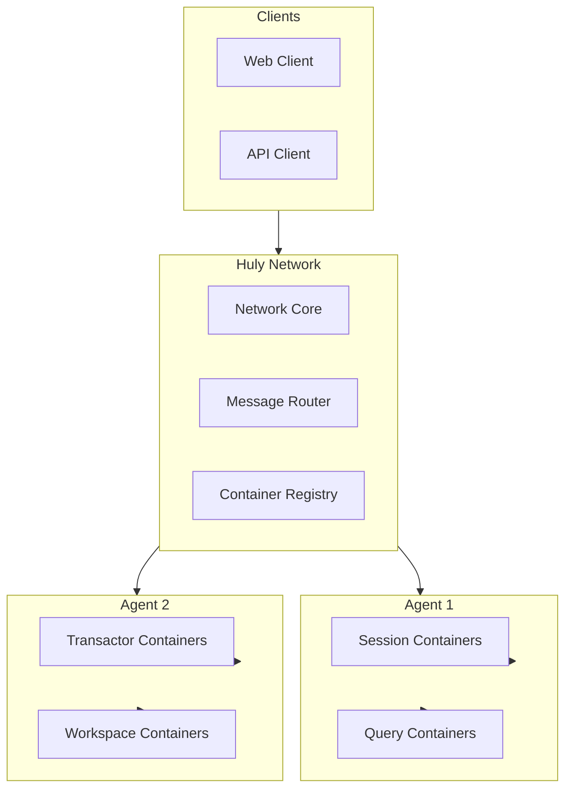
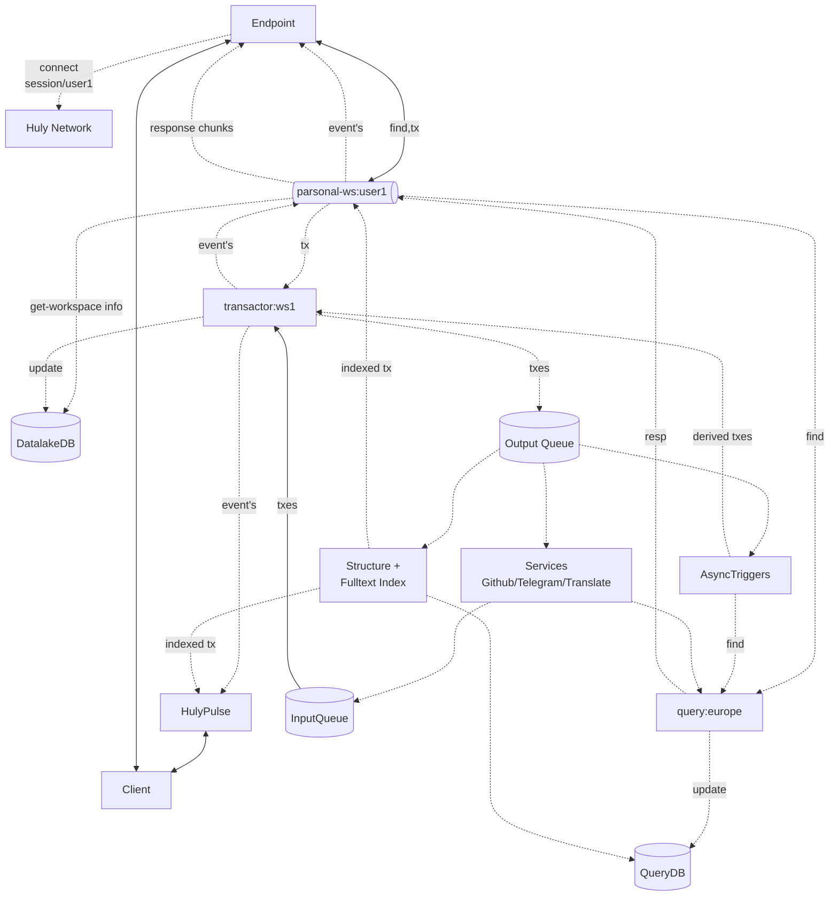

# Huly Virtual Network

A distributed, scalable virtual network architecture that enables fault-tolerant communication across distributed containers and agents.

## 🚀 Overview

The Huly Virtual Network is a sophisticated distributed system designed to handle enterprise-scale workloads with the following key capabilities:

- **Distributed Load Balancing**: Intelligent routing and round-robin distribution across multiple physical nodes
- **Multi-Tenant Architecture**: Secure isolation of containers for user sessions, query engines, and transaction processors
- **Fault Tolerance**: Automatic failover, health checks, and recovery mechanisms with orphaned container handling
- **Dynamic Scaling**: Horizontal scaling with automatic container lifecycle management
- **Real-time Communication**: Event-driven architecture with ZeroMQ-based messaging and broadcast capabilities

## 📦 Packages

This monorepo contains four main packages and deployment pods:

### Packages

- **`@hcengineering/network-core`**: Core network implementation, agent management, and container orchestration
- **`@hcengineering/network-backrpc`**: ZeroMQ-based RPC communication layer with bidirectional messaging
- **`@hcengineering/network-client`**: Client libraries for connecting to the network and managing containers
- **`@hcengineering/network-server`**: Network server implementation with multi-client support

### Deployment Pods

- **`@hcengineering/network-pod`**: Dockerized network server for production deployment

## 🏗️ Architecture

### Core Concepts

The Huly Virtual Network operates on three main concepts:

1. **Network**: Central coordinator that manages agents and routes container requests
2. **Agents**: Worker nodes that host and manage containers of specific kinds
3. **Containers**: Individual service instances that handle business logic

### Agents & Containers

**Agents** are the foundation for container management. They register with the network, advertise supported container kinds, and manage container lifecycles. Each agent can host multiple containers and provides:

- Container startup and termination
- Health monitoring and keep-alive functionality
- Local container routing and communication
- Resource management and isolation

**Containers** are the workhorses of the system. They can be:

- Located by `{kind + uuid}` or labels
- Communicated with via direct messages or request/response patterns
- Referenced by clients (containers remain active while referenced)
- Automatically terminated after a timeout when unreferenced

### Communication Patterns

Containers support two communication patterns:

1. **Fire-and-forget messaging**: Send data to containers without expecting responses
2. **Request/Response**: Establish connections for bidirectional communication with response handling

The network maintains references to containers. Referenced containers stay active, while unreferenced containers are kept alive for a configurable timeout before termination.



## 🛠️ Technology Stack

- **Language**: TypeScript 5.8+
- **Runtime**: Node.js 22+
- **Communication**: ZeroMQ 6.5+ for high-performance messaging
- **Build System**: Rush.js for monorepo management
- **Package Manager**: PNPM 10.15+
- **Testing**: Jest 29+ with comprehensive test coverage
- **License**: Eclipse Public License 2.0

## 🚀 Getting Started

### Prerequisites

- Node.js 22.00.0+
- PNPM (automatically installed via Rush)
- ZeroMQ native dependencies

### Installation

```bash
# Clone the repository
git clone https://github.com/hcengineering/huly.net.git
cd huly.net

# Install dependencies and build
node common/scripts/install-run-rush.js install
node common/scripts/install-run-rush.js build
```

### Docker Deployment

The network-pod provides a Dockerized version for production deployment:

```bash
# Build the Docker image
cd pods/network-pod
npm run docker:build

# Run the container
docker run -p 3737:3737 hardcoreeng/network-pod
```

### Quick Start Example

#### Setting up a Network Server

```typescript
import { NetworkImpl, TickManagerImpl } from '@hcengineering/network-core'
import { NetworkServer } from '@hcengineering/network-server'

// Create network components
const tickManager = new TickManagerImpl(1000) // 1000 ticks per second
tickManager.start()
const network = new NetworkImpl(tickManager)
const server = new NetworkServer(network, tickManager, '*', 3737)

console.log('Network server started on port 3737')
```

#### Creating and Registering an Agent

```typescript
import { AgentImpl } from '@hcengineering/network-core'
import { NetworkAgentServer } from '@hcengineering/network-client'

// Define container factory
const containerFactory = {
  session: async (uuid, request) => {
    const container = new SessionContainer(uuid)
    const endpoint = await container.start()
    return [container, endpoint]
  }
}

// Create and start agent
const agent = new AgentImpl('agent-1', containerFactory)
const agentServer = new NetworkAgentServer(tickManager, 'localhost', '*', 3738)

await agentServer.start(agent)
await networkClient.register(agent)
```

#### Connecting and Using Containers

```typescript
import { createNetworkClient } from '@hcengineering/network-client'

// Connect to network
const client = await createNetworkClient('localhost:3737')

// Get or create a container
const containerRef = await client.get('user-session-1', {
  kind: 'session',
  labels: { userId: 'user1' }
})

// Establish connection and communicate
const connection = await containerRef.connect()
const response = await connection.request('processData', { data: 'example' })

// Handle events
connection.on = async (event) => {
  console.log('Received event:', event)
}

// Cleanup
await connection.close()
await containerRef.release()
```

## 📚 API Reference

### Network Interface

The core `Network` interface provides:

- `register(record, agent)`: Register an agent with the network
- `unregister(agentId)`: Unregister an agent from the network
- `ping(agentId | clientId)`: Mark an agent or client as alive
- `get(client, uuid, request)`: Get or create a container
- `list(kind)`: List containers of a specific kind
- `release(client, uuid)`: Release a container reference
- `request(target, operation, data)`: Send request to container
- `agents()`: Get all registered agents
- `kinds()`: Get all supported container kinds

### Agent Interface

The `NetworkAgent` interface defines:

- `get(uuid, request)`: Start or get a container
- `getContainer(uuid)`: Get low-level container reference
- `list(kind?)`: List agent's containers
- `request(target, operation, data)`: Send request to container
- `terminate(endpoint)`: Terminate a container
- Properties: `uuid`, `endpoint`, `kinds`, `onUpdate`, `onAgentUpdate`

### Container Interface

The `Container` interface includes:

- `request(operation, data, clientId?)`: Handle requests
- `connect(clientId, broadcast)`: Accept client connections with broadcast callback
- `disconnect(clientId)`: Remove client connections
- `terminate()`: Cleanup and shutdown
- `ping()`: Health check response
- Optional: `onTerminated()`: Cleanup callback

### TickManager Interface

The `TickManager` handles time-based operations:

- `now()`: Get current timestamp
- `register(handler, interval)`: Register periodic handler (interval in seconds)
- `start()`: Start the tick manager
- `stop()`: Stop the tick manager
- `waitTick(ticks)`: Wait for specific number of ticks

## 🏗️ Building Applications

### Container Types

The network supports different container kinds for various use cases, every agent could provide a list of supported container kinds:

Examples of container kinds:

- **Session Containers**: Handle user sessions and authentication
- **Query Containers**: Process database queries and searches
- **Transactor Containers**: Manage transactions and data modifications
- **Workspace Containers**: Provide workspace-specific business logic

### Container Communication Patterns

#### Request/Response Pattern

```typescript
// Direct request to container
const result = await network.request(containerUuid, 'operation', data)

// Via connection
const connection = await containerRef.connect()
const result = await connection.request('operation', data)
```

#### Event Broadcasting

```typescript
// Container broadcasts events to connected clients
class MyContainer implements Container {
  private handlers = new Map<ClientUuid, Function>()

  connect(clientId: ClientUuid, handler: Function) {
    this.handlers.set(clientId, handler)
  }

  private broadcast(event: any) {
    for (const handler of this.handlers.values()) {
      handler(event)
    }
  }
}
```

### Health Monitoring

The network includes built-in health monitoring with configurable timeouts:

- **Agent Health Checks**: Automatic detection of inactive agents (default: 3-second timeout)
- **Ping Interval**: Regular ping to maintain agent connections (default: 1-second interval)
- **Dead Agent Detection**: Automatic cleanup of disconnected agents and their containers
- **Orphaned Container Recovery**: Cleanup of containers whose agents have disconnected
- **Container Reference Tracking**: Automatic lifecycle management based on client references

```typescript
import { timeouts } from '@hcengineering/network-core'

console.log('Alive timeout:', timeouts.aliveTimeout, 'seconds') // 3
console.log('Ping interval:', timeouts.pingInterval, 'seconds') // 1
```

## 🧪 Testing

Run the test suite:

```bash
# Install dependencies first
node common/scripts/install-run-rush.js install

# Run all tests
node common/scripts/install-run-rush.js test

# Run tests for specific package
cd packages/core && npm test
cd packages/backrpc && npm test
cd packages/client && npm test
cd packages/server && npm test

# Run build
node common/scripts/install-run-rush.js build

# Run with watch mode
node common/scripts/install-run-rush.js build:watch
```

## 🤝 Contributing

1. Fork the repository
2. Create a feature branch: `git checkout -b feature/amazing-feature`
3. Make your changes and add tests
4. Install dependencies: `node common/scripts/install-run-rush.js install`
5. Ensure all tests pass: `node common/scripts/install-run-rush.js test`
6. Format code: `node common/scripts/install-run-rush.js format`
7. Build project: `node common/scripts/install-run-rush.js build`
8. Commit changes: `git commit -s -m 'Add amazing feature'`
9. Push to branch: `git push origin feature/amazing-feature`
10. Open a Pull Request

### Development Setup

The project uses Rush.js for monorepo management:

- All packages share common build configuration
- Dependencies are managed at the workspace level
- Incremental builds and caching for faster development

## 📄 License

This project is licensed under the Eclipse Public License 2.0 - see the [LICENSE](LICENSE) file for details.

## 🔗 Related Projects

- [Huly Platform](https://github.com/hcengineering/platform) - The main Huly platform
- [ZeroMQ](https://zeromq.org/) - High-performance messaging library

---

**Note**: This is a foundational networking library for the Huly ecosystem. For application-level documentation, please refer to the main Huly platform repository.

## Huly on Network example

## Building Huly on top of Huly Network

Huly could be managed by following set of container kinds, `session`, `query`, `transactor`.

- session -> a map/reduce/find executor for queries and transactions from client.
- query -> a DB query engine, execute `find` requests from session and pass them to DB, allow to search for all data per region. Should have access to tables of account -> workspace mapping for security.
- transactor -> modification archestrator for all edit operations, do them one by one.


