<div align="center">

# 🌐 Huly Virtual Network

[](https://opensource.org/licenses/EPL-2.0)
[](https://www.npmjs.com/package/@hcengineering/network-core)
[](https://github.com/hcengineering/huly.net/actions)
[](https://www.typescriptlang.org/)
[](https://nodejs.org/)
[](CONTRIBUTING.md)

**A distributed, scalable virtual network architecture that enables fault-tolerant communication across distributed containers and agents.**

Build enterprise-grade distributed systems with automatic service discovery, high availability, and zero-configuration deployment.

[Features](#-why-build-your-product-on-huly-network) • [Quick Start](#-getting-started) • [Documentation](#-documentation) • [Examples](#-examples) • [API Reference](#-api-reference) • [Contributing](#-contributing)

```mermaid
flowchart TD
    subgraph Learn["📚 STEP 1: Core Concepts"]
        direction TB
        Network["🌐 Network Server<br/>Central hub, Port 3737<br/>⚠️ Single instance only"]
        Agent["🤖 Agent<br/>Runs containers<br/>✅ Multiple instances OK"]
        Container["📦 Container<br/>Your business logic<br/>Implements interface"]
        Client["💻 Client<br/>Requests containers<br/>Sends operations"]
    end

    Learn --> Deploy

    subgraph Deploy["🚀 STEP 2: Production Features"]
        direction TB
        P1["⚡ High Availability<br/>Multiple agents, auto-failover"]
        P2["🎯 Multi-tenancy<br/>Labels & routing"]
        P3["📡 Event Broadcasting<br/>Real-time updates"]
        P4["📈 Scale & Monitor<br/>Add agents, track health"]
    end

    Deploy --> Success([🎉 Production Ready!])

    style Success fill:#ffd700,stroke:#f57f17,stroke-width:3px
    style Learn fill:#e3f2fd,stroke:#1976d2
    style Deploy fill:#e8f5e9,stroke:#388e3c
```



</div>

---

## 📋 Table of Contents

- [Why Huly Network?](#-why-build-your-product-on-huly-network)
- [Overview](#-overview)
- [Architecture](#-architecture)
- [Packages](#-packages)
- [Quick Start](#-getting-started)
- [Examples](#-examples)
- [Documentation](#-documentation)
- [API Reference](#-api-reference)
- [Testing](#-testing)
- [Contributing](#-contributing)
- [License](#-license)

## 🌟 Why Build Your Product on Huly Network?

### Core Benefits

#### 🚀 Zero-Configuration Service Discovery

- No need for external service registries (Consul, etcd, ZooKeeper)
- Automatic container location and routing by kind and UUID
- Built-in label-based service discovery for flexible container selection

#### ⚡ High Performance Architecture

- ZeroMQ-based messaging for microsecond-latency communication
- Direct peer-to-peer connections between containers when possible
- Optimized routing through intelligent agent proxying

#### 🔄 Built-in High Availability

- Automatic failover with stateless container support
- Leader election without external coordination services
- Automatic orphaned container detection and cleanup
- Configurable health checks and timeouts

#### 📈 Effortless Horizontal Scaling

- Add agents dynamically without service interruption
- Round-robin load balancing across multiple agents
- Container lifecycle automatically managed by the network
- Support for thousands of concurrent containers

#### 🎯 Simplified Multi-Tenancy

- Natural isolation through container kinds and labels
- Per-tenant container instances with automatic management
- Secure client-to-container connections
- Reference counting ensures resources are freed appropriately

#### 🔌 Flexible Communication Patterns

- Request/response for synchronous operations
- Event broadcasting for real-time notifications
- Fire-and-forget messaging for async workflows
- Bidirectional streaming support

#### 🛠️ Developer-Friendly

- TypeScript-first with full type safety
- Simple, intuitive API with minimal boilerplate
- Comprehensive examples and documentation
- Built-in testing utilities and mocks

#### 🏢 Enterprise-Ready

- Battle-tested in production environments
- Comprehensive monitoring and observability
- Docker-ready deployment with official images
- Eclipse Public License 2.0 for commercial use

#### 💪 Production-Proven Features

- Automatic reconnection and retry logic
- Graceful degradation on partial failures
- Memory-efficient with automatic cleanup
- Configurable timeouts for different environments

## 🚀 Overview

The Huly Virtual Network is a sophisticated distributed system designed to handle enterprise-scale workloads with the following key capabilities:

- **Distributed Load Balancing**: Intelligent routing and round-robin distribution across multiple physical nodes
- **Multi-Tenant Architecture**: Secure isolation of containers for user sessions, query engines, and transaction processors
- **Fault Tolerance**: Automatic failover, health checks, and recovery mechanisms with orphaned container handling
- **Dynamic Scaling**: Horizontal scaling with automatic container lifecycle management
- **Real-time Communication**: Event-driven architecture with ZeroMQ-based messaging and broadcast capabilities

## 📦 Packages

This monorepo contains four main packages and deployment pods:

### Packages

- **`@hcengineering/network-core`**: Core network implementation, agent management, and container orchestration
- **`@hcengineering/network-backrpc`**: ZeroMQ-based RPC communication layer with bidirectional messaging
- **`@hcengineering/network-client`**: Client libraries for connecting to the network and managing containers
- **`@hcengineering/network-server`**: Network server implementation with multi-client support

### Deployment Pods

- **`@hcengineering/network-pod`**: Dockerized network server for production deployment

## ⚠️ Important Limitations

### Network Service Constraints

The **Network Server** (central coordinator) has the following limitations:

- **Single Instance Only**: The network service must run as a single instance
- **No HA Support**: The network service itself does not support high availability or clustering
- **Single Point of Failure**: If the network service fails, the entire system becomes unavailable

**Important**: While agents and containers support high availability through stateless container registration and automatic failover, the network service itself must be deployed as a singleton. For production deployments:

- Use process monitoring (systemd, PM2, Kubernetes with restart policies)
- Implement quick restart mechanisms
- Monitor network service health closely
- Plan for brief downtime during network service restarts

Agents and containers will automatically reconnect when the network service restarts.

## 🏗️ Architecture

### Core Concepts

The Huly Virtual Network operates on three main concepts:

1. **Network**: Central coordinator that manages agents and routes container requests
2. **Agents**: Worker nodes that host and manage containers of specific kinds
3. **Containers**: Individual service instances that handle business logic

### Agents & Containers

**Agents** are the foundation for container management. They register with the network, advertise supported container kinds, and manage container lifecycles. Each agent can host multiple containers and provides:

- Container startup and termination
- Health monitoring and keep-alive functionality
- Local container routing and communication
- Resource management and isolation

**Containers** are the workhorses of the system. They can be:

- Located by `{kind + uuid}` or labels
- Communicated with via direct messages or request/response patterns
- Referenced by clients (containers remain active while referenced)
- Automatically terminated after a timeout when unreferenced

### Communication Patterns

Containers support two communication patterns:

1. **Fire-and-forget messaging**: Send data to containers without expecting responses
2. **Request/Response**: Establish connections for bidirectional communication with response handling

The network maintains references to containers. Referenced containers stay active, while unreferenced containers are kept alive for a configurable timeout before termination.


## 🛠️ Technology Stack

- **Language**: TypeScript 5.8+
- **Runtime**: Node.js 22+
- **Communication**: ZeroMQ 6.5+ for high-performance messaging
- **Build System**: Rush.js for monorepo management
- **Package Manager**: PNPM 10.15+
- **Testing**: Jest 29+ with comprehensive test coverage
- **License**: Eclipse Public License 2.0

## 🚀 Getting Started

### Prerequisites

- Node.js 22.00.0+
- PNPM (automatically installed via Rush)
- ZeroMQ native dependencies

### Installation

```bash
# Clone the repository
git clone https://github.com/hcengineering/huly.net.git
cd huly.net

# Install dependencies and build
node common/scripts/install-run-rush.js install
node common/scripts/install-run-rush.js build
```

### Docker Deployment

The network-pod provides a Dockerized version for production deployment:

```bash
# Build the Docker image
cd pods/network-pod
npm run docker:build

# Run the container
docker run -p 3737:3737 hardcoreeng/network-pod
```

### Quick Start Example

Here's a complete end-to-end example to get you started:

```typescript
import { NetworkImpl, TickManagerImpl } from '@hcengineering/network-core'
import { NetworkServer } from '@hcengineering/network-server'
import { createNetworkClient, createAgent } from '@hcengineering/network-client'
import type { Container, ContainerUuid, ClientUuid } from '@hcengineering/network-core'

// 1. Create a simple container implementation
class MyServiceContainer implements Container {
  constructor(readonly uuid: ContainerUuid) {}

  async request(operation: string, data?: any): Promise<any> {
    console.log(`Processing ${operation}:`, data)
    return { success: true, result: `Processed ${operation}` }
  }

  async ping(): Promise<void> {
    // Health check
  }

  async terminate(): Promise<void> {
    console.log('Container terminated')
  }

  connect(clientId: ClientUuid, broadcast: (data: any) => Promise<void>): void {
    // Store broadcast function for later use
  }

  disconnect(clientId: ClientUuid): void {
    // Remove client connection
  }
}

async function main() {
  // 2. Start the network server (NOTE: Only one instance allowed - no HA support)
  const tickManager = new TickManagerImpl(1000)
  tickManager.start()
  const network = new NetworkImpl(tickManager)
  const server = new NetworkServer(network, tickManager, '*', 3737)
  console.log('Network server started on port 3737')

  // 3. Create and start an agent
  const { agent, server: agentServer } = await createAgent('localhost:3738', {
    'my-service': async (options) => {
      const uuid = options.uuid ?? (('container-' + Date.now()) as ContainerUuid)
      const container = new MyServiceContainer(uuid)
      return {
        uuid,
        container,
        endpoint: `my-service://localhost/${uuid}` as any
      }
    }
  })

  // 4. Connect as a client
  const client = createNetworkClient('localhost:3737')
  await client.waitConnection(5000)
  console.log('Client connected')

  // 5. Register the agent
  await client.register(agent)
  console.log('Agent registered')

  // 6. Request a container
  const containerRef = await client.get('my-service' as any, {})
  console.log('Got container:', containerRef.uuid)

  // 7. Send a request
  const result = await containerRef.request('processData', { value: 42 })
  console.log('Result:', result)

  // 8. Cleanup
  await containerRef.close()
  await client.close()
  await agentServer.close()
  await server.close()
  tickManager.stop()
}

main().catch(console.error)
```

## 📚 Documentation

### 📖 Guides

- **[Core Concepts](docs/CORE_CONCEPTS.md)** - Understand the architecture and design principles
- **[Quick Start Guide](docs/QUICKSTART.md)** - Get up and running in minutes
- **[Production Deployment](docs/PRODUCTION_DEPLOYMENT.md)** - Deploy to production environments
- **[Container Development](docs/CONTAINER_DEVELOPMENT.md)** - Build custom containers
- **[High Availability Setup](docs/QUICKSTART_HA.md)** - Configure HA with stateless containers
- **[HA Stateless Containers](docs/HA_STATELESS_CONTAINERS.md)** - Deep dive into HA patterns
- **[Multi-Tenant Architecture](docs/MULTI_TENANT.md)** - Implement multi-tenancy

### 🎯 Examples

All examples are available in the [`examples/`](examples/) directory:

1. **[Basic Request/Response](examples/01-basic-container-request-response.ts)** - Simple container communication
2. **[Event Broadcasting](examples/02-event-broadcasting.ts)** - Real-time event distribution
3. **[Multi-Tenant Setup](examples/03-multi-tenant.ts)** - Per-tenant container isolation
4. **[Production Setup](examples/04-complete-production-setup.ts)** - Complete production configuration
5. **[Error Handling & Retry](examples/05-error-handling-retry.ts)** - Robust error handling patterns
6. **[Custom Timeouts](examples/custom-timeout-example.ts)** - Environment-specific timeouts
7. **[HA Stateless Containers](examples/ha-stateless-container-example.ts)** - Automatic failover

See the [Examples README](examples/README.md) for detailed explanations and usage instructions.

## � Detailed Example Walkthroughs

### Example 1: Basic Container with Request/Response

This example shows a simple container that handles requests and maintains state:

```typescript
import type { Container, ContainerUuid, ClientUuid } from '@hcengineering/network-core'

class DataProcessorContainer implements Container {
  private data: Map<string, any> = new Map()

  constructor(readonly uuid: ContainerUuid) {
    console.log(`DataProcessor ${uuid} created`)
  }

  async request(operation: string, data?: any, clientId?: ClientUuid): Promise<any> {
    switch (operation) {
      case 'store':
        this.data.set(data.key, data.value)
        return { success: true, key: data.key }

      case 'retrieve':
        const value = this.data.get(data.key)
        return { success: true, value, found: value !== undefined }

      case 'delete':
        const existed = this.data.delete(data.key)
        return { success: true, deleted: existed }

      case 'list':
        return { success: true, keys: Array.from(this.data.keys()) }

      default:
        return { success: false, error: 'Unknown operation' }
    }
  }

  async ping(): Promise<void> {
    // Health check - container is alive
  }

  async terminate(): Promise<void> {
    console.log(`DataProcessor ${this.uuid} terminating...`)
    this.data.clear()
  }

  connect(clientId: ClientUuid, broadcast: (data: any) => Promise<void>): void {
    // Not using events in this example
  }

  disconnect(clientId: ClientUuid): void {
    // Cleanup client connection
  }
}

// Usage
const containerRef = await client.get('data-processor' as any, {})

await containerRef.request('store', { key: 'user:123', value: { name: 'John' } })
const result = await containerRef.request('retrieve', { key: 'user:123' })
console.log(result) // { success: true, value: { name: 'John' }, found: true }

await containerRef.close()
```

### Example 2: Event Broadcasting Container

This example demonstrates real-time event broadcasting to multiple connected clients:

```typescript
import type { Container, ContainerUuid, ClientUuid } from '@hcengineering/network-core'

class ChatRoomContainer implements Container {
  private clients = new Map<ClientUuid, (data: any) => Promise<void>>()
  private messages: string[] = []

  constructor(readonly uuid: ContainerUuid, readonly roomName: string) {
    console.log(`ChatRoom ${roomName} created`)
  }

  async request(operation: string, data?: any, clientId?: ClientUuid): Promise<any> {
    switch (operation) {
      case 'sendMessage':
        const message = `${data.username}: ${data.text}`
        this.messages.push(message)

        // Broadcast to all connected clients
        await this.broadcast({ type: 'newMessage', message, timestamp: Date.now() })

        return { success: true, messageId: this.messages.length - 1 }

      case 'getHistory':
        return { success: true, messages: this.messages }

      case 'getUserCount':
        return { success: true, count: this.clients.size }

      default:
        return { success: false, error: 'Unknown operation' }
    }
  }

  async ping(): Promise<void> {}

  async terminate(): Promise<void> {
    console.log(`ChatRoom ${this.roomName} closing...`)
    await this.broadcast({ type: 'roomClosed', roomName: this.roomName })
    this.clients.clear()
  }

  connect(clientId: ClientUuid, broadcast: (data: any) => Promise<void>): void {
    console.log(`Client ${clientId} connected to ${this.roomName}`)
    this.clients.set(clientId, broadcast)

    // Send welcome message to new client
    broadcast({ type: 'welcome', message: `Welcome to ${this.roomName}!` }).catch(console.error)
  }

  disconnect(clientId: ClientUuid): void {
    console.log(`Client ${clientId} disconnected from ${this.roomName}`)
    this.clients.delete(clientId)
  }

  private async broadcast(event: any): Promise<void> {
    const promises = Array.from(this.clients.values()).map((handler) =>
      handler(event).catch((err) => console.error('Broadcast error:', err))
    )
    await Promise.all(promises)
  }
}

// Usage
const chatRef = await client.get('chat-room' as any, {
  uuid: 'room-general' as any,
  labels: ['public', 'general']
})

// Connect to receive events
const connection = await chatRef.connect()
connection.on = async (event) => {
  console.log('Received event:', event.type, event.message)
}

// Send a message
await connection.request('sendMessage', {
  username: 'Alice',
  text: 'Hello everyone!'
})

// Later, disconnect
await connection.close()
await chatRef.close()
```

### Example 3: High Availability with Stateless Containers

This example shows how to implement automatic failover for critical services:

```typescript
import { TickManagerImpl, AgentImpl } from '@hcengineering/network-core'
import { createNetworkClient, NetworkAgentServer } from '@hcengineering/network-client'
import type { Container, ContainerUuid, ClientUuid, ContainerKind } from '@hcengineering/network-core'

class LeaderServiceContainer implements Container {
  private isActive = false

  constructor(readonly uuid: ContainerUuid, readonly instanceName: string) {}

  async request(operation: string, data?: any): Promise<any> {
    switch (operation) {
      case 'status':
        return {
          uuid: this.uuid,
          instance: this.instanceName,
          active: this.isActive,
          timestamp: Date.now()
        }

      case 'activate':
        this.isActive = true
        console.log(`[${this.instanceName}] Activated as leader`)
        return { success: true }

      case 'processTask':
        if (!this.isActive) {
          return { success: false, error: 'Not active leader' }
        }
        console.log(`[${this.instanceName}] Processing task:`, data)
        return { success: true, processedBy: this.instanceName }

      default:
        return { success: false, error: 'Unknown operation' }
    }
  }

  async ping(): Promise<void> {}

  async terminate(): Promise<void> {
    console.log(`[${this.instanceName}] Shutting down`)
    this.isActive = false
  }

  connect(clientId: ClientUuid, broadcast: (data: any) => Promise<void>): void {}
  disconnect(clientId: ClientUuid): void {}
}

async function createHAAgent(agentId: string, instanceName: string, sharedUuid: ContainerUuid, port: number) {
  const tickManager = new TickManagerImpl(1)
  const agent = new AgentImpl(agentId as any, {})

  // Add stateless container for HA
  const container = new LeaderServiceContainer(sharedUuid, instanceName)
  agent.addStatelessContainer(
    sharedUuid,
    'leader-service' as ContainerKind,
    `leader://${instanceName}/${sharedUuid}` as any,
    container
  )

  const server = new NetworkAgentServer(tickManager, 'localhost', '*', port)
  await server.start(agent)

  return { agent, server, container, tickManager }
}

async function runHAExample() {
  // Shared UUID for the leader service
  const leaderUuid = 'service-leader-001' as ContainerUuid

  // Connect to network
  const client = createNetworkClient('localhost:3737')
  await client.waitConnection(5000)

  // Create two competing agents
  const primary = await createHAAgent('agent-primary', 'Primary', leaderUuid, 3801)
  const secondary = await createHAAgent('agent-secondary', 'Secondary', leaderUuid, 3802)

  // Register both - first wins
  console.log('Registering primary agent...')
  await client.register(primary.agent)

  console.log('Registering secondary agent...')
  await client.register(secondary.agent) // Will be rejected

  // Monitor failover events
  client.onUpdate(async (event) => {
    for (const container of event.containers) {
      if (container.event === 2) {
        // NetworkEventKind.removed
        console.log(`Container removed: ${container.container.uuid}`)
        console.log('Failover should occur automatically...')
      }
    }
  })

  // Activate primary
  const leaderRef = await client.get('leader-service' as any, { uuid: leaderUuid })
  await leaderRef.request('activate')

  // Send some tasks
  for (let i = 0; i < 3; i++) {
    const result = await leaderRef.request('processTask', { taskId: i, data: 'test' })
    console.log('Task result:', result)
    await new Promise((resolve) => setTimeout(resolve, 500))
  }

  // Simulate primary failure
  console.log('\n=== Simulating Primary Failure ===')
  await primary.agent.terminate(leaderUuid)
  await new Promise((resolve) => setTimeout(resolve, 2000)) // Wait for failover

  // Secondary should take over
  const newLeaderRef = await client.get('leader-service' as any, { uuid: leaderUuid })
  const status = await newLeaderRef.request('status')
  console.log('New leader status:', status) // Should be Secondary

  // Cleanup
  await leaderRef.close()
  await newLeaderRef.close()
  await client.close()
  await primary.server.close()
  await secondary.server.close()
  primary.tickManager.stop()
  secondary.tickManager.stop()
}

runHAExample().catch(console.error)
```

### Example 4: Multi-Tenant Container Management

This example demonstrates managing per-tenant containers with labels:

```typescript
import type { Container, ContainerUuid, ClientUuid, GetOptions } from '@hcengineering/network-core'

class TenantWorkspaceContainer implements Container {
  private users = new Set<string>()
  private documents = new Map<string, any>()

  constructor(readonly uuid: ContainerUuid, readonly tenantId: string) {
    console.log(`Workspace created for tenant: ${tenantId}`)
  }

  async request(operation: string, data?: any, clientId?: ClientUuid): Promise<any> {
    // All operations are tenant-isolated
    switch (operation) {
      case 'addUser':
        this.users.add(data.userId)
        return { success: true, userCount: this.users.size }

      case 'createDocument':
        const docId = `doc-${Date.now()}`
        this.documents.set(docId, { ...data, createdAt: Date.now() })
        return { success: true, documentId: docId }

      case 'getDocument':
        const doc = this.documents.get(data.documentId)
        return { success: true, document: doc }

      case 'listDocuments':
        return {
          success: true,
          documents: Array.from(this.documents.entries()).map(([id, doc]) => ({ id, ...doc }))
        }

      case 'getStats':
        return {
          success: true,
          tenantId: this.tenantId,
          userCount: this.users.size,
          documentCount: this.documents.size
        }

      default:
        return { success: false, error: 'Unknown operation' }
    }
  }

  async ping(): Promise<void> {}

  async terminate(): Promise<void> {
    console.log(`Workspace for tenant ${this.tenantId} terminated`)
    this.users.clear()
    this.documents.clear()
  }

  connect(clientId: ClientUuid, broadcast: (data: any) => Promise<void>): void {}
  disconnect(clientId: ClientUuid): void {}
}

// Setup agent with tenant workspace factory
const { agent, server: agentServer } = await createAgent('localhost:3738', {
  'tenant-workspace': async (options: GetOptions) => {
    const tenantId = options.labels?.[0] || 'default'
    const uuid = options.uuid ?? (`workspace-${tenantId}-${Date.now()}` as ContainerUuid)
    const container = new TenantWorkspaceContainer(uuid, tenantId)
    return {
      uuid,
      container,
      endpoint: `workspace://${tenantId}/${uuid}` as any
    }
  }
})

// Usage: Get workspace for specific tenant
async function getTenantWorkspace(client: any, tenantId: string) {
  return await client.get('tenant-workspace' as any, {
    labels: [tenantId],
    extra: { tenantId }
  })
}

// Example usage
const tenant1Workspace = await getTenantWorkspace(client, 'tenant-acme')
await tenant1Workspace.request('addUser', { userId: 'user-1' })
await tenant1Workspace.request('createDocument', {
  title: 'Q1 Report',
  content: 'Financial data...'
})

const tenant2Workspace = await getTenantWorkspace(client, 'tenant-globex')
await tenant2Workspace.request('addUser', { userId: 'user-2' })

// Each tenant has isolated data
const stats1 = await tenant1Workspace.request('getStats')
const stats2 = await tenant2Workspace.request('getStats')

console.log('Tenant 1 stats:', stats1)
console.log('Tenant 2 stats:', stats2)

await tenant1Workspace.close()
await tenant2Workspace.close()
```

### Example 5: Custom Timeouts for Different Environments

This example shows how to configure timeouts for development vs production:

```typescript
import { createNetworkClient } from '@hcengineering/network-client'

// Development: Long timeout for debugging (1 hour)
const devClient = createNetworkClient('localhost:3737', 3600)

// Production: Short timeout for fast failure detection (3 seconds - default)
const prodClient = createNetworkClient('production-network:3737')

// Custom timeout for specific use case (30 seconds)
const customClient = createNetworkClient('localhost:3737', 30)

async function developmentWorkflow() {
  await devClient.waitConnection(10000) // 10 second connection timeout

  // Container will stay alive for 1 hour even without activity
  // Perfect for debugging and stepping through code
  const containerRef = await devClient.get('debug-service' as any, {})

  // ... debug your code without worrying about timeouts

  await containerRef.close()
  await devClient.close()
}

async function productionWorkflow() {
  await prodClient.waitConnection(5000) // 5 second connection timeout

  // Container will be cleaned up after 3 seconds of inactivity
  // Ensures resources are freed quickly in production
  const containerRef = await prodClient.get('prod-service' as any, {})

  // Do work...
  const result = await containerRef.request('process', { data: 'important' })

  await containerRef.close()
  await prodClient.close()
}

// Environment-based configuration
function createClientForEnvironment(networkHost: string) {
  const isDevelopment = process.env.NODE_ENV === 'development'
  const timeout = isDevelopment ? 3600 : 3 // 1 hour vs 3 seconds

  return createNetworkClient(networkHost, timeout)
}

const client = createClientForEnvironment('localhost:3737')
```

### Example 6: Direct Container Communication

This example shows using direct connections vs routed connections:

```typescript
import type { Container, ContainerUuid, ClientUuid } from '@hcengineering/network-core'
import { NetworkServer } from '@hcengineering/network-server'

class DirectAccessContainer implements Container {
  constructor(readonly uuid: ContainerUuid) {}

  async request(operation: string, data?: any): Promise<any> {
    // High-performance direct request handling
    return { result: `Processed ${operation} with data`, data }
  }

  async ping(): Promise<void> {}
  async terminate(): Promise<void> {}
  connect(clientId: ClientUuid, broadcast: (data: any) => Promise<void>): void {}
  disconnect(clientId: ClientUuid): void {}
}

// When you get a container reference, you can connect to it
const containerRef = await client.get('direct-service' as any, {})

// Option 1: Request through network (routed)
const result1 = await containerRef.request('operation', { value: 1 })

// Option 2: Establish direct connection (faster for multiple requests)
const connection = await containerRef.connect()
const result2 = await connection.request('operation', { value: 2 })
const result3 = await connection.request('operation', { value: 3 })

// Direct connections are faster because they bypass the network router
// after the initial connection is established

await connection.close()
await containerRef.close()
```

### Example 7: Container Lifecycle Monitoring

This example demonstrates monitoring container lifecycle and network events:

```typescript
import type { NetworkEvent, NetworkEventKind } from '@hcengineering/network-core'

// Monitor all network events
const unsubscribe = client.onUpdate(async (event: NetworkEvent) => {
  console.log('=== Network Event ===')

  // Agent events
  for (const agentEvent of event.agents) {
    const eventType = ['added', 'updated', 'removed'][agentEvent.event]
    console.log(`Agent ${agentEvent.id}: ${eventType}`)
    console.log('  Supports kinds:', agentEvent.kinds)
  }

  // Container events
  for (const containerEvent of event.containers) {
    const eventType = ['added', 'updated', 'removed'][containerEvent.event]
    console.log(`Container ${containerEvent.container.uuid}: ${eventType}`)
    console.log('  Kind:', containerEvent.container.kind)
    console.log('  Agent:', containerEvent.container.agentId)
    console.log('  Labels:', containerEvent.container.labels)

    if (containerEvent.event === 2) {
      // NetworkEventKind.removed
      console.log('  Container was removed - may trigger failover')
    }
  }
})

// Do some work...
const ref = await client.get('monitored-service' as any, {})
await ref.request('doWork', {})
await ref.close()

// Stop monitoring
unsubscribe()
```

### Example 8: Error Handling and Retry Logic

This example shows proper error handling patterns:

```typescript
async function robustContainerAccess(client: any, kind: string, options: any, maxRetries = 3) {
  let lastError: Error | undefined

  for (let attempt = 1; attempt <= maxRetries; attempt++) {
    try {
      console.log(`Attempt ${attempt}/${maxRetries}...`)

      // Try to get container
      const containerRef = await client.get(kind, options)

      try {
        // Try to send request
        const result = await containerRef.request('process', { attempt })
        console.log('Success:', result)
        return result
      } catch (requestError: any) {
        console.error('Request failed:', requestError.message)
        lastError = requestError

        // Release the failed container
        await containerRef.close().catch(() => {})

        // Wait before retry with exponential backoff
        if (attempt < maxRetries) {
          const delay = Math.min(1000 * Math.pow(2, attempt - 1), 10000)
          console.log(`Waiting ${delay}ms before retry...`)
          await new Promise((resolve) => setTimeout(resolve, delay))
        }
      }
    } catch (getError: any) {
      console.error('Failed to get container:', getError.message)
      lastError = getError

      if (attempt < maxRetries) {
        await new Promise((resolve) => setTimeout(resolve, 1000))
      }
    }
  }

  throw new Error(`Failed after ${maxRetries} attempts: ${lastError?.message}`)
}

// Usage
try {
  const result = await robustContainerAccess(client, 'unreliable-service' as any, { labels: ['production'] })
  console.log('Final result:', result)
} catch (error: any) {
  console.error('All attempts failed:', error.message)
  // Handle permanent failure (alerting, fallback, etc.)
}
```

### Example 9: Complete Production Setup

This example shows a complete production-ready setup:

```typescript
import { NetworkImpl, TickManagerImpl, AgentImpl } from '@hcengineering/network-core'
import { NetworkServer } from '@hcengineering/network-server'
import { createNetworkClient, NetworkAgentServer } from '@hcengineering/network-client'

// Production container with proper lifecycle management
class ProductionContainer implements Container {
  private connections = new Map<ClientUuid, (data: any) => Promise<void>>()
  private shutdownRequested = false

  constructor(readonly uuid: ContainerUuid, private readonly config: any) {
    console.log(`[${uuid}] Container started`)
  }

  async request(operation: string, data?: any, clientId?: ClientUuid): Promise<any> {
    if (this.shutdownRequested) {
      throw new Error('Container is shutting down')
    }

    try {
      // Your business logic here
      console.log(`[${this.uuid}] Processing ${operation}`)
      return { success: true, operation, clientId }
    } catch (error: any) {
      console.error(`[${this.uuid}] Error processing ${operation}:`, error)
      throw error
    }
  }

  async ping(): Promise<void> {
    // Health check - verify dependencies, connections, etc.
    if (this.shutdownRequested) {
      throw new Error('Container is shutting down')
    }
  }

  async terminate(): Promise<void> {
    if (this.shutdownRequested) return

    this.shutdownRequested = true
    console.log(`[${this.uuid}] Terminating...`)

    // Notify all connected clients
    await this.broadcastShutdown()

    // Cleanup resources
    this.connections.clear()

    console.log(`[${this.uuid}] Terminated`)
  }

  connect(clientId: ClientUuid, broadcast: (data: any) => Promise<void>): void {
    console.log(`[${this.uuid}] Client ${clientId} connected`)
    this.connections.set(clientId, broadcast)
  }

  disconnect(clientId: ClientUuid): void {
    console.log(`[${this.uuid}] Client ${clientId} disconnected`)
    this.connections.delete(clientId)
  }

  private async broadcastShutdown(): Promise<void> {
    const promises = Array.from(this.connections.values()).map((handler) =>
      handler({ type: 'shutdown', message: 'Container is terminating' }).catch((err) =>
        console.error('Failed to notify client:', err)
      )
    )
    await Promise.all(promises)
  }
}

async function startProductionSystem() {
  // 1. Start network server
  const tickManager = new TickManagerImpl(1000)
  tickManager.start()

  const network = new NetworkImpl(tickManager)
  const server = new NetworkServer(
    network,
    tickManager,
    '*', // Bind to all interfaces
    3737
  )
  console.log('✓ Network server started on port 3737')

  // 2. Start multiple agents for redundancy
  const agents = []
  for (let i = 1; i <= 3; i++) {
    const agent = new AgentImpl(`agent-${i}` as any, {
      'production-service': async (options) => {
        const uuid = options.uuid ?? (`svc-${Date.now()}-${i}` as ContainerUuid)
        const container = new ProductionContainer(uuid, { agentId: i })
        return {
          uuid,
          container,
          endpoint: `prod://${i}/${uuid}` as any
        }
      }
    })

    const agentServer = new NetworkAgentServer(tickManager, 'localhost', '*', 3738 + i)
    await agentServer.start(agent)
    agents.push({ agent, server: agentServer })
    console.log(`✓ Agent ${i} started on port ${3738 + i}`)
  }

  // 3. Connect clients
  const client = createNetworkClient('localhost:3737')
  await client.waitConnection(5000)
  console.log('✓ Client connected')

  // 4. Register all agents
  for (const { agent } of agents) {
    await client.register(agent)
  }
  console.log('✓ All agents registered')

  // 5. Setup monitoring
  client.onUpdate(async (event) => {
    // Log events for monitoring/alerting
    event.agents.forEach((a) => console.log(`Agent event: ${a.id}`))
    event.containers.forEach((c) => console.log(`Container event: ${c.container.uuid}`))
  })

  console.log('✓ Production system ready')

  // Return cleanup function
  return async () => {
    console.log('Shutting down...')
    await client.close()
    for (const { server } of agents) {
      await server.close()
    }
    await server.close()
    tickManager.stop()
    console.log('✓ Shutdown complete')
  }
}

// Start and handle graceful shutdown
const cleanup = await startProductionSystem()

process.on('SIGTERM', async () => {
  console.log('Received SIGTERM')
  await cleanup()
  process.exit(0)
})

process.on('SIGINT', async () => {
  console.log('Received SIGINT')
  await cleanup()
  process.exit(0)
})
```

---

## 📚 API Reference

### Network Interface

The core `Network` interface provides:

- `register(record, agent)`: Register an agent with the network
- `unregister(agentId)`: Unregister an agent from the network
- `ping(agentId | clientId)`: Mark an agent or client as alive
- `get(client, uuid, request)`: Get or create a container
- `list(kind)`: List containers of a specific kind
- `release(client, uuid)`: Release a container reference
- `request(target, operation, data)`: Send request to container
- `agents()`: Get all registered agents
- `kinds()`: Get all supported container kinds

### Agent Interface

The `NetworkAgent` interface defines:

- `get(uuid, request)`: Start or get a container
- `getContainer(uuid)`: Get low-level container reference
- `list(kind?)`: List agent's containers
- `request(target, operation, data)`: Send request to container
- `terminate(endpoint)`: Terminate a container
- Properties: `uuid`, `endpoint`, `kinds`, `onUpdate`, `onAgentUpdate`

### Container Interface

The `Container` interface includes:

- `request(operation, data, clientId?)`: Handle requests
- `connect(clientId, broadcast)`: Accept client connections with broadcast callback
- `disconnect(clientId)`: Remove client connections
- `terminate()`: Cleanup and shutdown
- `ping()`: Health check response
- Optional: `onTerminated()`: Cleanup callback

### TickManager Interface

The `TickManager` handles time-based operations:

- `now()`: Get current timestamp
- `register(handler, interval)`: Register periodic handler (interval in seconds)
- `start()`: Start the tick manager
- `stop()`: Stop the tick manager
- `waitTick(ticks)`: Wait for specific number of ticks

## 🏗️ Building Applications

### Container Types

The network supports different container kinds for various use cases, every agent could provide a list of supported container kinds:

Examples of container kinds:

- **Session Containers**: Handle user sessions and authentication
- **Query Containers**: Process database queries and searches
- **Transactor Containers**: Manage transactions and data modifications
- **Workspace Containers**: Provide workspace-specific business logic

### Container Communication Patterns

#### Request/Response Pattern

```typescript
// Direct request to container
const result = await network.request(containerUuid, 'operation', data)

// Via connection
const connection = await containerRef.connect()
const result = await connection.request('operation', data)
```

#### Event Broadcasting

```typescript
// Container broadcasts events to connected clients
class MyContainer implements Container {
  private handlers = new Map<ClientUuid, Function>()

  connect(clientId: ClientUuid, handler: Function) {
    this.handlers.set(clientId, handler)
  }

  private broadcast(event: any) {
    for (const handler of this.handlers.values()) {
      handler(event)
    }
  }
}
```

### Health Monitoring

The network includes built-in health monitoring with configurable timeouts:

- **Agent Health Checks**: Automatic detection of inactive agents (default: 3-second timeout)
- **Ping Interval**: Regular ping to maintain agent connections (default: 1-second interval)
- **Dead Agent Detection**: Automatic cleanup of disconnected agents and their containers
- **Orphaned Container Recovery**: Cleanup of containers whose agents have disconnected
- **Container Reference Tracking**: Automatic lifecycle management based on client references

```typescript
import { timeouts } from '@hcengineering/network-core'

console.log('Alive timeout:', timeouts.aliveTimeout, 'seconds') // 3
console.log('Ping interval:', timeouts.pingInterval, 'seconds') // 1
```

## 🧪 Testing

Run the test suite:

```bash
# Install dependencies first
node common/scripts/install-run-rush.js install

# Run all tests
node common/scripts/install-run-rush.js test

# Run tests for specific package
cd packages/core && npm test
cd packages/backrpc && npm test
cd packages/client && npm test
cd packages/server && npm test

# Run build
node common/scripts/install-run-rush.js build

# Run with watch mode
node common/scripts/install-run-rush.js build:watch
```

## 🤝 Contributing

We love contributions! Huly Virtual Network is open source and we welcome contributions of all kinds:

- 🐛 **Bug Reports**: Found a bug? [Open an issue](https://github.com/hcengineering/huly.net/issues/new?template=bug_report.md)
- ✨ **Feature Requests**: Have an idea? [Request a feature](https://github.com/hcengineering/huly.net/issues/new?template=feature_request.md)
- 📖 **Documentation**: Improve our docs, add examples, or fix typos
- 💻 **Code**: Submit pull requests with bug fixes or new features
- ❓ **Questions**: [Ask questions](https://github.com/hcengineering/huly.net/issues/new?template=question.md) to help improve our documentation

Please read our [Contributing Guide](CONTRIBUTING.md) for details on our development process, coding standards, and how to submit pull requests.

### Quick Contribution Guide

1. **Fork** the repository
2. **Create** a feature branch: `git checkout -b feature/amazing-feature`
3. **Make** your changes and add tests
4. **Run** tests: `node common/scripts/install-run-rush.js test`
5. **Format** code: `node common/scripts/install-run-rush.js format`
6. **Commit** with sign-off: `git commit -s -m 'Add amazing feature'`
7. **Push** to your fork: `git push origin feature/amazing-feature`
8. **Open** a Pull Request

### Development Commands

```bash
# Install dependencies
node common/scripts/install-run-rush.js install

# Build all packages
node common/scripts/install-run-rush.js build

# Run tests
node common/scripts/install-run-rush.js test

# Format code
node common/scripts/install-run-rush.js format

# Build with watch mode
node common/scripts/install-run-rush.js build:watch
```

See our [Contributing Guide](CONTRIBUTING.md) for more detailed information.

## 📄 License

This project is licensed under the **Eclipse Public License 2.0** - see the [LICENSE](LICENSE) file for details.

The EPL-2.0 is a business-friendly open source license that allows you to:

- ✅ Use the software commercially
- ✅ Modify the software
- ✅ Distribute the software
- ✅ Use the software privately
- ✅ Include it in proprietary software

Learn more about [EPL-2.0](https://www.eclipse.org/legal/epl-2.0/).

## 🔒 Security

**Important Security Notice**: Huly Network is currently suited for **private cloud installations** within trusted network environments.

### Current Security Model

- **No Built-in Authentication**: The network does not include authentication or authorization mechanisms
- **No Encryption**: Communication between network components is unencrypted
- **Trusted Environment Assumption**: All agents, containers, and clients are assumed to be trustworthy
- **Performance Priority**: Security features are intentionally omitted to maximize performance, but will be added laterly.

### Deployment Recommendations

For production deployments, we strongly recommend:

1. **Network Isolation**: Deploy within a private network or VPC
2. **Firewall Rules**: Restrict access to network ports (default: 3737) using firewall rules
3. **VPN/Private Network**: Use VPN or private network infrastructure for remote access
4. **Network Segmentation**: Isolate the Huly Network from public-facing services

### Future Security Enhancements

We are considering adding optional security features in future releases:

- TLS/SSL encryption for inter-component communication
- Authentication mechanisms for agent registration
- Authorization controls for container access
- Audit logging for security monitoring

If you have specific security requirements or concerns, please [open an issue](https://github.com/hcengineering/huly.net/issues) to discuss your use case.

## 🙏 Acknowledgments

- Built with [ZeroMQ](https://zeromq.org/) for high-performance messaging
- Managed with [Rush.js](https://rushjs.io/) for monorepo orchestration
- Part of the [Huly Platform](https://github.com/hcengineering/platform) ecosystem

## 📬 Contact & Support

- **Issues**: [GitHub Issues](https://github.com/hcengineering/huly.net/issues)
- **Discussions**: [GitHub Discussions](https://github.com/hcengineering/huly.net/discussions)
- **Website**: [huly.io](https://huly.io)
- **Twitter**: [@huly_platform](https://twitter.com/huly_platform)

## 🗺️ Roadmap

See our [project roadmap](https://github.com/hcengineering/huly.net/projects) for upcoming features and improvements.

## 📊 Project Status

This project is actively maintained and used in production by the Huly Platform. We welcome contributions and feedback!

## ⭐ Star History

If you find this project useful, please consider giving it a star! It helps others discover the project.

[](https://star-history.com/#hcengineering/huly.net&Date)

## 🔗 Related Projects

- **[Huly Platform](https://github.com/hcengineering/platform)** - The main Huly platform that uses this network
- **[ZeroMQ](https://zeromq.org/)** - High-performance asynchronous messaging library
- **[Rush.js](https://rushjs.io/)** - Scalable monorepo build orchestrator

---

<div align="center">

**Built with ❤️ by the Huly Platform team**

[⬆ back to top](#-huly-virtual-network)

</div>
