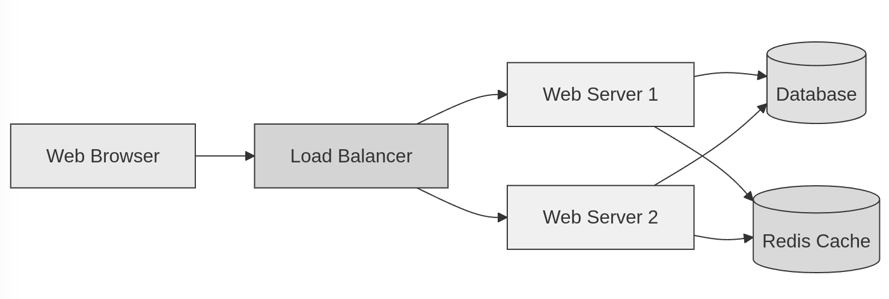

# User Guide

Our platform architecture and key components.

## System Overview

## Development Workflow
- Code reviews via GitHub integration
- CI/CD status in Huly Activity Feed
- Team sync-ups in Huly Virtual Office 
