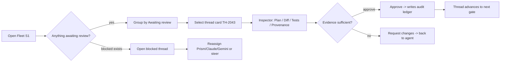
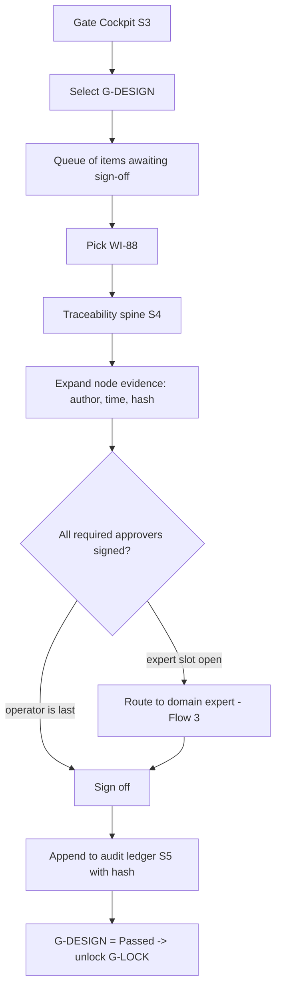
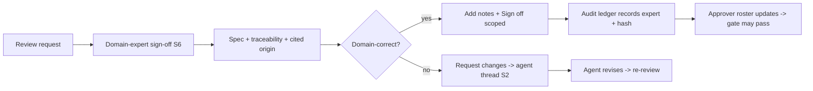
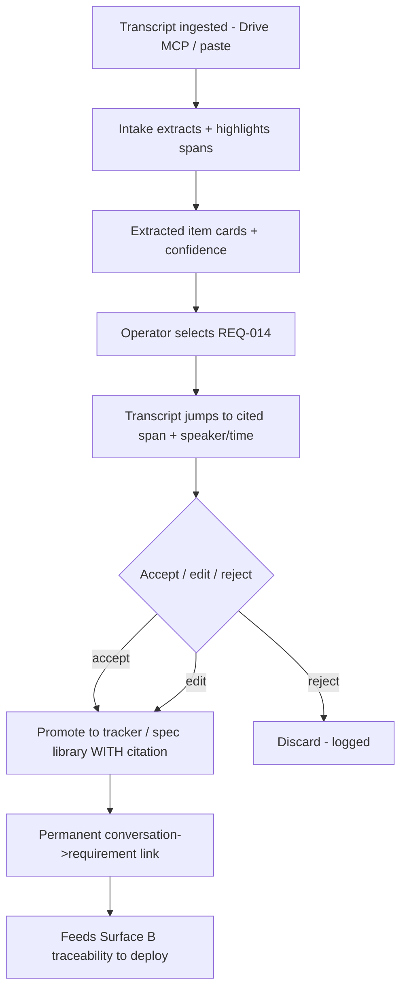
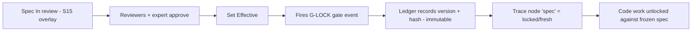

# 4C Shade — Console UI/UX Map (`UI-UX-MAP.md`)

*Track A / G-DESIGN deliverable. Screen inventory + primary user flows for the **product console** (the 4C Shade / `<Org> Shade` interface). Companion to `DESIGN.md` (tokens) and the clickable prototypes in `/prototypes`. Keeps client-confidential HardscapeOS/Dibbits specifics out — examples are generic software-delivery.*

---

## 1 · Design principles

1. **Agent-native, not human-CRUD.** The primary operators are agents (Prism / Claude / Gemini); the human's job is to **steer and sign off**, not to type every field. The default view is a *fleet of work in motion*, not an empty form.
2. **Artifact-first review.** You review the **thing produced** — a plan, a diff, test evidence, a spec — not a status label about it. Every state in the console is one click from the artifact that justifies it.
3. **Gates & traceability are first-class objects.** The 5 gates and the requirement→spec→code→test→deploy chain are navigable objects with their own state, approvers, and audit history — not metadata hidden in a sidebar. This is the moat surface; it gets the fidelity.
4. **Provable delivery over faster delivery.** When "show more evidence" competes with "fewer clicks", evidence wins. Immutable audit, content hashes, and who-approved-what are visible by default because the product's promise is *"delivery you can stand behind."*
5. **Provenance runs to the origin.** Nothing is a floating assertion: a work-item traces up to the **conversation span** that created it (second brain) and down to the **deploy** that satisfied it. The chain is the product.
6. **Scoping discipline — differentiate, don't out-polish.** High fidelity goes to the surfaces **nobody else has**: fleet/mission-control, the gate + traceability cockpit, and second-brain intake. The **backbone screens** (tracker, docs, controlled-doc QMS) are **Huly's existing UI + a Shade overlay** (top bar, rail, accent, gate ribbon, status chips) — we do **not** redesign them and we do **not** try to beat Cursor / GitHub / Antigravity at generic agent-manager UX.

---

## 2 · Screen inventory

Priority: **P0** = differentiating (build & prototype first) · **P1** = supporting console · **P2** = backbone overlay (Huly UI + Shade skin, minimal net-new design).

| # | Screen | Purpose | Priority | Primary artifacts shown |
|---|---|---|---|---|
| S1 | **Fleet / Mission Control** | See + steer all parallel agent threads, grouped by state | **P0** | Agent-thread cards; plan / diff / test-evidence chips; fleet summary tiles |
| S2 | **Agent Thread detail** | Drill into one agent's run: transcript, plan, artifacts, hand-offs | **P0** | Plan doc, unified diff, test run log, tool calls, provenance chain |
| S3 | **Gate Cockpit** | The 5 gates as objects; queue of items awaiting each gate | **P0** | Gate objects; items-awaiting list; approver roster |
| S4 | **Traceability view** | requirement ↔ spec ↔ code ↔ test ↔ deploy spine for a work-item | **P0** | Trace nodes/edges; per-node evidence; coverage state |
| S5 | **Audit Ledger** | Immutable who-approved-what, hash-chained | **P0** | Ledger rows (actor · action · object · hash · time) |
| S6 | **Domain-expert sign-off** | Approve at spec/gate/artifact level (not only eng diff review) | **P0** | Spec/artifact under review; sign-off action; expert notes |
| S7 | **Second-Brain Intake** | Expert conversation → cited scope / work-items / specs | **P0** | Transcript with highlighted spans; extracted item cards; citations |
| S8 | **Knowledge Graph** | Browse domain-knowledge nodes agents are grounded on | P1 | Concept nodes, sources, links to specs/items |
| S9 | **Artifact Review drawer** | Shared inspector: Plan / Diff / Tests / Provenance tabs | **P0** | Whatever artifact is selected, + its audit + trace |
| S10 | **Global search / command** | Jump to any object by id (REQ-, G-, TH-, hash) | P1 | Ranked objects across all types |
| S11 | **Workspace / instance switch** | Switch `<Org> Shade` workspace + settings | P1 | Workspace list, members, agent roster, gate config |
| S12 | **Activity feed** | Chronological cross-object event stream | P1 | Activity items (Huly `activity` overlay) |
| S13 | **Tracker (PM)** | Issues / cycles / modules | **P2** | Huly tracker + Shade overlay |
| S14 | **Documents (KB)** | Knowledge base docs | **P2** | Huly documents + Shade overlay |
| S15 | **Controlled Docs (QMS specs)** | Spec lifecycle Draft→Review→Effective | **P2** | Huly controlled-documents + Shade overlay + gate wiring |
| S16 | **Test Management** | Test suites / runs | **P2** | Huly test-management + Shade overlay |

**Prototyped this pass (highest-value P0):** S1 (`agent-fleet.html`), S3+S4+S5+S6 combined (`gate-traceability.html`), S7 (`second-brain.html`). S2 and S9 appear as the inspector drawer inside those.

---

## 3 · The 4 differentiating surfaces (prototype-grade detail)

### Surface A — Agent fleet / mission control (S1, S2, S9)

**Goal:** one screen to see everything the fleet is doing and to intervene, review, or approve — artifact-first.

- **Fleet summary strip** (top): stat tiles — *Active threads · Awaiting your review · Blocked · Merged today* — plus a tiny throughput sparkline (threads reaching "Done" over the last N hours). Reserved status colors; tabular numerics.
- **Board:** columns by **thread state** — Planning · Working · Awaiting review · Blocked · Done. Each column header shows a count; an "Awaiting review" column carries a `--warn` edge because it is the human's queue.
- **Agent-thread card** (§6.1 of DESIGN.md): identity stripe in agent color, monogram avatar, thread id (mono), work-item + `REQ` link, one-line current activity, **artifact chips** (`Plan`, `Diff +142/−31`, `Tests 18/18`), elapsed time, model/tier tag. A card awaiting a gate shows a gate badge.
- **Steer actions on a card:** Approve plan · Request changes · Reassign (Prism↔Claude↔Gemini) · Pause · Open thread. Selecting a card opens the **inspector drawer** (S9) with Plan / Diff / Tests / Provenance tabs.
- **Grouping toggle:** by state (default) · by agent · by work-item / epic · by gate.
- **Why it differentiates:** it is *fleet* mission-control (many parallel threads across three agent types) with **review built into the card**, not a single-agent chat log. The artifact-first chip row is the wedge.

### Surface B — Gate + traceability cockpit (S3, S4, S5, S6)

**Goal:** make the QMS-gated, fully-traceable delivery loop *operable* — the uncontested white space.

- **Gate ribbon / board:** the 5 gates — **G-DESIGN · G-LOCK · G-PUSH · G-CLIENT · G-MONEY** — as objects, each with state chip, progress ("3 of 4 signed"), and required approvers (including a **domain-expert** slot). Selecting a gate reveals its **queue of items awaiting sign-off**.
- **Traceability spine (S4):** for a selected work-item, a horizontal **requirement → spec → code → test → deploy** chain of nodes; edges painted with the spectral gradient when the chain is intact, greyed/dashed where a link is stale or missing. Each node expands to its **evidence** (source excerpt, author agent/human, timestamp, content hash). This is the "prove it" view.
- **Audit ledger (S5):** append-only, hash-chained rows — `timestamp · actor · action · object-id · hash (prev←)`. Filterable by gate, actor, object. Immutable by design (ISO-42001-aligned).
- **Domain-expert sign-off (S6):** the differentiator vs. senior-eng-only review — an expert approves at the **spec / gate / artifact** level. Action panel: view the spec + its traceability, add expert notes, then **Sign off** (writes actor + hash + time to the ledger) or **Request changes**. Approvals are scoped: an expert can sign G-DESIGN or a spec's correctness without touching code review.
- **Why it differentiates:** gates-as-objects + full requirement↔deploy traceability + an immutable audit ledger + non-engineer expert sign-off is the combination competitors don't have and regulation (EU AI Act Aug 2026, ISO 42001) is about to demand.

### Surface C — Second-brain intake (S7, S8)

**Goal:** turn expert conversations into cited, grounded, structured work — owning the *upstream* of the flywheel.

- **Three panes:** (1) **conversation transcript** with speaker turns + timestamps and **highlighted spans** where intake extracted something; (2) **extracted items** — cards typed as Requirement / Work-item / Spec / Risk, each with a generated id (mono), a one-line statement, and a **confidence** meter; (3) **provenance** — clicking an item jumps the transcript to and highlights the exact span that produced it, showing speaker + timestamp + source.
- **Grounding:** each item shows which **domain-knowledge nodes** it drew on / contributes to (chips linking to S8). Accept / edit / reject controls promote an extracted item into the tracker or the spec library — carrying its citation with it.
- **Provenance trail:** the promoted work-item keeps a permanent **conversation → requirement** link, so the traceability spine (Surface B) can run all the way back to the sentence a domain expert actually said.
- **Why it differentiates:** competitors start at "here's a ticket." Shade starts at "here's the conversation, and here's the cited line that justifies this requirement" — and that citation survives all the way to deploy.

### Surface D — Backbone screens with Shade overlays (S13–S16) — **P2, do not redesign**

**Goal:** make Huly's tracker / documents / controlled-docs / test-management read as one product with the console, with *minimum* net-new design.

- **The overlay = tokens only:** apply the Shade top context bar, left rail, accent, status/gate chips, and the gate ribbon to Huly's existing screens. Rebrand (`<Org> Shade`), swap the palette to the Shade tokens, and wire the **controlled-documents lifecycle** (Draft → In review → **Effective**) to **G-LOCK** so a spec going Effective is a real gate event that lands in the audit ledger.
- **Explicitly out of scope this pass:** re-laying-out tracker boards, doc editors, or test grids. Those are Huly's, and they are good enough; our fidelity budget is spent on Surfaces A–C.

---

## 4 · Primary user flows

### Flow 1 — Steer a parallel agent fleet + review an artifact

1. Operator opens **Fleet / Mission Control (S1)**; scans the summary strip — *2 threads awaiting review*.
2. Filters/groups the board by **Awaiting review**; sees a Claude thread `TH-2043` on `REQ-014` with a `Diff +142/−31` and `Tests 18/18` chip.
3. Clicks the card → **inspector drawer (S9)** opens on the **Diff** tab; flips to **Tests** (all green) and **Provenance** (chain intact back to `REQ-014`).
4. Approves the plan / diff → action writes to the **audit ledger (S5)**; thread advances toward its next gate.
5. A Gemini design thread is stuck in **Blocked** → operator **reassigns** part of the work to Prism to unblock, or opens the thread (S2) to add direction.

### Flow 2 — Gate approval (G-DESIGN) with the traceability view

1. Operator opens **Gate Cockpit (S3)**; the gate ribbon shows **G-DESIGN** with `◐ Awaiting · 3 of 4 signed`.
2. Selects **G-DESIGN** → queue of items awaiting design sign-off; picks work-item `WI-88 "Checkout redesign"`.
3. Opens its **traceability spine (S4)**: `REQ-014 → SPEC-07 → (code pending) → (tests pending) → (deploy pending)`; the requirement→spec edge is intact (spectral), later edges are locked because the gate hasn't passed.
4. Reviews the **spec artifact** + expands each node's evidence (who authored, when, hash).
5. Confirms required approvers; the **domain-expert** slot is still open → routes to the expert (Flow 3) or, if the operator *is* the last approver, **signs off**.
6. Sign-off writes actor + object + content-hash + timestamp to the **audit ledger (S5)**; G-DESIGN flips to `● Passed`; downstream gates (G-LOCK…) unlock; the spectral chain extends.

### Flow 3 — Domain-expert sign-off at spec / gate level

1. Domain expert (not an engineer) receives a review request; opens **Domain-expert sign-off (S6)** for `SPEC-07`.
2. Sees the spec, its **traceability** to `REQ-014`, and the **cited conversation origin** (link into S7) — no code required to judge correctness.
3. Reads the requirement's provenance; confirms the spec is domain-correct; adds expert notes.
4. **Signs off** (scoped to spec correctness / G-DESIGN) → recorded in the **audit ledger (S5)** with the expert as actor. Or **Requests changes**, which returns the item to the responsible agent thread (S2) with the notes attached.
5. The gate's approver roster updates; when the last required approver signs, the gate passes (rejoins Flow 2 step 6).

### Flow 4 — Second-brain intake: conversation → cited scope / work-items

1. A client/prospect call transcript lands in **Second-Brain Intake (S7)** (via Google Drive/Workspace MCP or manual paste).
2. Intake highlights spans and proposes **extracted items** (Requirement / Work-item / Spec / Risk), each with a confidence meter.
3. Operator clicks an extracted `REQ-014` → transcript scrolls to and highlights the **exact span** the expert said; provenance shows speaker + timestamp + source.
4. Operator **accepts / edits / rejects** each item; accepted items promote into the **tracker / spec library**, carrying the citation.
5. The promoted item now has a permanent **conversation → requirement** link, so Surface B's traceability spine can run from the spoken sentence all the way to deploy.

### Flow 5 — Spec lifecycle → G-LOCK (backbone overlay in action)

1. In **Controlled Docs (S15, Huly + overlay)** a spec sits in **In review**.
2. Reviewers (incl. domain expert via S6) approve; the spec is set **Effective**.
3. Going Effective **fires G-LOCK** — a real gate event written to the audit ledger; the spec version is frozen and its hash recorded.
4. The traceability spine (S4) marks the `spec` node as locked/fresh; downstream code work may now start against a frozen spec.

---

## 5 · Navigation model

- **Left rail** — *Console* group (Fleet · Gates · Second Brain · Activity) over the hairline; *Backbone* group (Tracker · Documents · Specs/QMS · Tests) under it. Collapsible to icons.
- **Top context bar** — `<Org> Shade` workspace switcher · breadcrumb · **gate ribbon** (5 dots, global gate state, always visible) · global search (`⌘K`, jump by object id) · actor/agent menu.
- **Inspector drawer** — right, opens on any object selection; the single home of artifact-first review across screens.
- **Cross-links are the point:** a thread card → its work-item → its traceability spine → each node's evidence → the gate it's blocked on → the ledger row that will record the approval → back to the conversation span that started it. Every arrow in the flywheel is a clickable link in the UI.

---

## 6 · What we deliberately did NOT design

- Tracker boards, doc editor, test grids — **Huly's**, kept as-is under the overlay.
- A bespoke terminal/browser-embedded console — **roadmap**, not v1 (interim cockpit is Claude CLI + MCP in Zed).
- Prism's single-chat-over-fleet conversational surface — flagged **OQ-3** for G-DESIGN; board-first for v1.
- Billing/invoice screens for G-MONEY beyond the gate object itself — deferred to the Xero/Mercury MCP integration pass.
