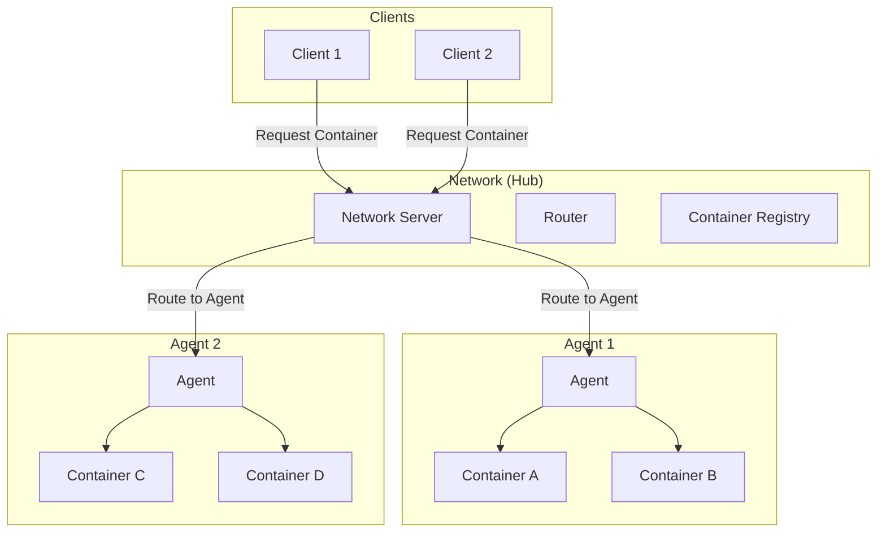
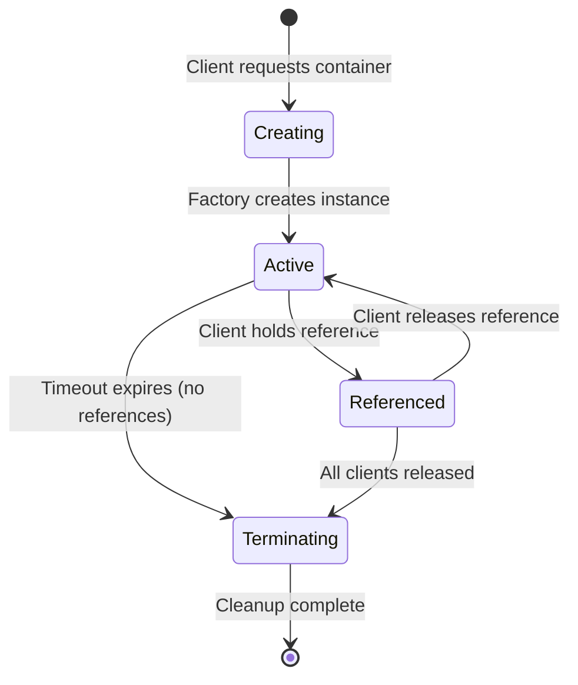

# Core Concepts

Understanding the fundamental concepts of Huly Virtual Network is essential for building robust distributed systems.

## Table of Contents

- [Architecture Overview](#architecture-overview)
- [Network](#network)
- [Agents](#agents)
- [Containers](#containers)
- [Clients](#clients)
- [Communication Patterns](#communication-patterns)
- [Lifecycle Management](#lifecycle-management)
- [Endpoint References](#endpoint-references)
- [Container Kinds and Labels](#container-kinds-and-labels)

## Architecture Overview

Huly Network uses a hub-and-spoke architecture with three main components:



### Key Principles

1. **Centralized Coordination**: The network server coordinates all agents and containers
2. **Distributed Execution**: Containers run on agents, which can be distributed across multiple machines
3. **Dynamic Discovery**: Clients discover and connect to containers through the network
4. **Automatic Lifecycle**: The network manages container lifecycles based on client references
5. **Fault Tolerance**: Automatic cleanup of failed agents and orphaned containers

## Network

The **Network** is the central coordinator that:

- Maintains a registry of all agents and their capabilities
- Tracks all active containers and their locations
- Routes client requests to appropriate containers
- Manages container lifecycles (creation, reference counting, cleanup)
- Provides service discovery and load balancing
- Broadcasts events to clients about system changes

### Network Responsibilities

```typescript
interface Network {
  // Agent management
  register(record: AgentRecord, agent: NetworkAgentApi): Promise<ContainerUuid[]>
  unregister(agentId: AgentUuid): Promise<void>
  ping(agentId: AgentUuid): Promise<void>

  // Container management
  get(client: ClientUuid, kind: ContainerKind, options: GetOptions): Promise<[ContainerUuid, ContainerEndpointRef]>
  release(client: ClientUuid, uuid: ContainerUuid): Promise<void>
  list(kind?: ContainerKind): Promise<ContainerRecord[]>

  // Communication
  request(target: ContainerUuid, operation: string, data?: any): Promise<any>

  // Discovery
  agents(): AgentRecord[]
  kinds(): ContainerKind[]
}
```

### Network Server

The network server listens on a TCP port (default: 3737) and:

- Accepts connections from clients and agents
- Uses ZeroMQ for high-performance messaging
- Handles concurrent requests efficiently
- Maintains connection health through ping/pong

**Example: Starting a Network Server**

```typescript
import { NetworkImpl, TickManagerImpl } from '@hcengineering/network-core'
import { NetworkServer } from '@hcengineering/network-server'

const tickManager = new TickManagerImpl(1000) // 1000 ticks/sec
tickManager.start()

const network = new NetworkImpl(tickManager)
const server = new NetworkServer(
  network,
  tickManager,
  '*', // Bind to all interfaces
  3737 // Port
)

console.log('Network server running on port 3737')
```

## Agents

**Agents** are worker processes that:

- Host and manage containers
- Register with the network to advertise capabilities
- Create containers on-demand or pre-provision them (stateless)
- Handle container lifecycle (start, stop, health checks)
- Route requests between clients and containers

### Agent Capabilities

Each agent declares which **container kinds** it can create:

```typescript
// Note: For production code, use serveAgent() on the client
// This example uses AgentImpl directly for educational purposes
const agent = new AgentImpl('my-agent' as AgentUuid, {
  session: async (options) => {
    /* create session container */
  },
  workspace: async (options) => {
    /* create workspace container */
  },
  query: async (options) => {
    /* create query container */
  }
})
```

### Agent Registration

Agents register with the network to announce availability:

```typescript
import { NetworkAgentServer } from '@hcengineering/network-client'

const agentServer = new NetworkAgentServer(
  tickManager,
  'localhost', // Network host
  '*', // Bind address
  3738 // Agent port for container connections
)

await agentServer.start(agent)

// Register with network
await client.register(agent)
```

### Agent Health

Agents must:

- Send regular pings to the network (default: every 1 second)
- Respond to health checks
- Handle graceful shutdown
- Clean up containers on termination

If an agent fails to ping within the `aliveTimeout` (default: 3 seconds), the network:

1. Marks the agent as dead
2. Removes all its containers
3. Broadcasts removal events
4. Allows standby agents to take over (for stateless containers)

## Containers

**Containers** are the workhorses of the system. They:

- Implement specific business logic
- Process requests from clients
- Maintain internal state
- Broadcast events to connected clients
- Are automatically created and destroyed based on demand

### Container Interface

Every container must implement:

```typescript
interface Container {
  // Handle incoming requests
  request(operation: string, data?: any, clientId?: ClientUuid): Promise<any>

  // Health check
  ping(): Promise<void>

  // Cleanup and shutdown
  terminate(): Promise<void>

  // Event broadcasting support
  connect(clientId: ClientUuid, broadcast: (data: any) => Promise<void>): void
  disconnect(clientId: ClientUuid): void

  // Optional termination callback
  onTerminated?(): void
}
```

### Container Lifecycle



**Key lifecycle events:**

1. **Creation**: Factory method called when container is requested
2. **Active**: Container is running and processing requests
3. **Referenced**: At least one client holds a reference
4. **Idle Timeout**: Container kept alive for `containerTimeout` after last reference released
5. **Termination**: `terminate()` called, then removed from network

### Container Types

#### Stateful Containers (Dynamic)

Created on-demand when requested:

```typescript
// Note: For production code, use serveAgent() on the client
// This example uses AgentImpl directly for educational purposes
const agent = new AgentImpl('agent-1' as any, {
  'user-session': async (options: GetOptions) => {
    const uuid = options.uuid ?? generateUuid()
    const container = new UserSessionContainer(uuid, options)
    return {
      uuid,
      container,
      endpoint: `session://agent1/${uuid}` as any
    }
  }
})
```

#### Stateless Containers (Pre-provisioned)

Pre-created for high availability:

```typescript
const leaderContainer = new LeaderContainer('leader-001' as ContainerUuid)

agent.addStatelessContainer(
  'leader-001' as ContainerUuid,
  'leader' as ContainerKind,
  'leader://agent1/leader-001' as ContainerEndpointRef,
  leaderContainer
)
```

Multiple agents can register the same stateless container UUID. The network accepts the first and rejects others, enabling automatic failover.

### Container Example

```typescript
import type { Container, ContainerUuid, ClientUuid } from '@hcengineering/network-core'

class DataStoreContainer implements Container {
  private data = new Map<string, any>()
  private connections = new Map<ClientUuid, (data: any) => Promise<void>>()

  constructor(readonly uuid: ContainerUuid) {}

  async request(operation: string, data?: any): Promise<any> {
    switch (operation) {
      case 'set':
        this.data.set(data.key, data.value)
        await this.broadcast({ type: 'dataChanged', key: data.key })
        return { success: true }

      case 'get':
        return { value: this.data.get(data.key) }

      default:
        return { error: 'Unknown operation' }
    }
  }

  async ping(): Promise<void> {}

  async terminate(): Promise<void> {
    this.data.clear()
    this.connections.clear()
  }

  connect(clientId: ClientUuid, broadcast: (data: any) => Promise<void>): void {
    this.connections.set(clientId, broadcast)
  }

  disconnect(clientId: ClientUuid): void {
    this.connections.delete(clientId)
  }

  private async broadcast(event: any): Promise<void> {
    const promises = Array.from(this.connections.values()).map((fn) => fn(event))
    await Promise.all(promises)
  }
}
```

## Clients

**Clients** are applications or services that:

- Connect to the network server
- Request containers by kind and optional criteria
- Send requests to containers
- Receive events from containers
- Manage container references (acquire/release)

### Client Connection

```typescript
import { createNetworkClient } from '@hcengineering/network-client'

const client = createNetworkClient(
  'localhost:3737', // Network address
  3600 // Alive timeout in seconds (optional)
)

await client.waitConnection(5000) // Wait up to 5 seconds
```

### Requesting Containers

Clients request containers by **kind** and optional **criteria**:

```typescript
// Get any container of this kind
const ref = await client.get('user-session' as ContainerKind, {})

// Get specific container by UUID
const ref = await client.get('user-session' as ContainerKind, {
  uuid: 'session-123' as ContainerUuid
})

// Get container with labels
const ref = await client.get('workspace' as ContainerKind, {
  labels: ['premium', 'us-west']
})

// Get container with extra data
const ref = await client.get('query-engine' as ContainerKind, {
  extra: { database: 'analytics', userId: 'user-456' }
})
```

### Client API

```typescript
interface NetworkClient {
  // Container management
  get(kind: ContainerKind, request: GetOptions): Promise<ContainerReference>
  list(kind?: ContainerKind): Promise<ContainerRecord[]>

  // Agent management
  register(agent: NetworkAgent): Promise<void>
  unregister(agentId: AgentUuid): Promise<void>

  // Discovery
  agents(): AgentRecord[]
  kinds(): ContainerKind[]

  // Events
  onUpdate(listener: NetworkUpdateListener): () => void

  // Connection
  close(): Promise<void>
}
```

## Communication Patterns

Huly Network supports multiple communication patterns:

### 1. Request/Response (Synchronous)

Direct request to container with response:

```typescript
const result = await containerRef.request('processData', {
  value: 42
})
console.log(result) // { processed: true, result: 84 }
```

### 2. Fire-and-Forget (Asynchronous)

Send data without waiting for response:

```typescript
await containerRef.request('logEvent', {
  event: 'user_login',
  timestamp: Date.now()
})
```

### 3. Event Broadcasting (Publish/Subscribe)

Container broadcasts events to all connected clients:

```typescript
// Client side
const connection = await containerRef.connect()
connection.on = async (event) => {
  console.log('Received:', event)
}

// Container side
connect(clientId: ClientUuid, broadcast: (data: any) => Promise<void>): void {
  this.clients.set(clientId, broadcast)
}

// Broadcast to all clients
for (const broadcast of this.clients.values()) {
  await broadcast({ type: 'update', data: changes })
}
```

### 4. Bidirectional Streaming

Establish persistent connection for streaming:

```typescript
const connection = await containerRef.connect()

// Receive stream
connection.on = async (chunk) => {
  console.log('Chunk:', chunk)
}

// Send requests
await connection.request('subscribe', { topic: 'updates' })
await connection.request('getData', { range: [0, 100] })
```

## Lifecycle Management

### Reference Counting

The network uses reference counting to manage container lifecycles:

- Each `client.get()` increments the reference count
- Each `containerRef.close()` decrements it
- Containers with zero references are kept alive for `containerTimeout`
- After timeout, containers are automatically terminated

```typescript
// Acquire reference (ref count = 1)
const ref1 = await client.get('service' as any, { uuid: 'svc-1' })

// Acquire another reference to same container (ref count = 2)
const ref2 = await client.get('service' as any, { uuid: 'svc-1' })

// Release first reference (ref count = 1)
await ref1.close()

// Release second reference (ref count = 0)
await ref2.close()

// Container kept alive for containerTimeout, then terminated
```

### Health Monitoring

The network continuously monitors health:

**Agent Health:**

- Agents must ping every `pingInterval` (default: 1 second)
- Network marks agent as dead after `aliveTimeout` (default: 3 seconds)
- Dead agents' containers are removed

**Container Health:**

- Containers respond to `ping()` calls
- Failed pings may trigger termination
- Unhealthy containers are removed from registry

### Graceful Shutdown

Proper cleanup on shutdown:

```typescript
// Container cleanup
async terminate(): Promise<void> {
  // 1. Notify connected clients
  await this.broadcastShutdown()

  // 2. Close external connections
  await this.database.close()

  // 3. Clear internal state
  this.data.clear()

  // 4. Release resources
  this.connections.clear()
}

// Agent cleanup
await agentServer.close()
tickManager.stop()

// Client cleanup
await containerRef.close()
await client.close()

// Server cleanup
await server.close()
tickManager.stop()
```

## Endpoint References

Containers are addressed by **endpoint references**:

```typescript
type ContainerEndpointRef = string & { _containerEndpointRef: true }
```

### Endpoint Types

1. **Direct Endpoint**: Direct connection to container

   ```
   tcp://host:port/uuid
   ```

2. **Routed Endpoint**: Connection through agent

   ```
   agent://host:port:agentId/uuid
   ```

3. **No-Connect Endpoint**: Request-only, no persistent connection
   ```
   noconnect://host:port/uuid
   ```

### Parsing Endpoints

```typescript
import { parseEndpointRef, EndpointKind } from '@hcengineering/network-core'

const parsed = parseEndpointRef(endpoint)
console.log(parsed.kind) // EndpointKind.direct | routed | noconnect
console.log(parsed.host) // Host address
console.log(parsed.port) // Port number
console.log(parsed.uuid) // Container UUID
console.log(parsed.agentId) // Agent ID (for routed)
```

## Container Kinds and Labels

### Container Kinds

Containers are categorized by **kind** (string type):

```typescript
type ContainerKind = string & { _containerKind: true }
```

Examples:

- `'user-session'` - User session management
- `'workspace'` - Workspace containers
- `'query-engine'` - Query processing
- `'transactor'` - Transaction handling

Agents declare which kinds they support:

```typescript
// Note: For production code, use serveAgent() on the client
// This example uses AgentImpl directly for educational purposes
const agent = new AgentImpl('agent-1' as any, {
  'user-session': sessionFactory,
  workspace: workspaceFactory,
  'query-engine': queryFactory
})
```

### Labels

Containers can have **labels** for fine-grained selection:

```typescript
// Create container with labels
await client.get('workspace' as any, {
  labels: ['premium', 'us-west', 'production']
})

// Labels enable:
// - Multi-tenancy (tenant ID as label)
// - Geographic routing (region labels)
// - Tier-based selection (free, premium, enterprise)
// - Environment separation (dev, staging, production)
```

### Get Options

```typescript
interface GetOptions {
  uuid?: ContainerUuid // Specific container UUID
  extra?: Record<string, any> // Additional parameters for factory
  labels?: string[] // Labels for selection
}
```

## Summary

Key concepts to remember:

1. **Network** = Central coordinator
2. **Agent** = Worker node hosting containers
3. **Container** = Service instance with business logic
4. **Client** = Application requesting containers
5. **Reference Counting** = Automatic lifecycle management
6. **Endpoint** = Address for reaching a container
7. **Kind** = Container type/category
8. **Labels** = Fine-grained selection criteria

These concepts form the foundation for building scalable, fault-tolerant distributed systems with Huly Network.

## Next Steps

- [Container Development Guide](CONTAINER_DEVELOPMENT.md) - Build your first container
- [Agent Development Guide](AGENT_DEVELOPMENT.md) - Create custom agents
- [Client Usage Guide](CLIENT_USAGE.md) - Connect and use containers
- [Production Deployment](PRODUCTION_DEPLOYMENT.md) - Deploy to production

---

Need more help? Check the [Troubleshooting Guide](TROUBLESHOOTING.md) or [Examples](../examples/).
