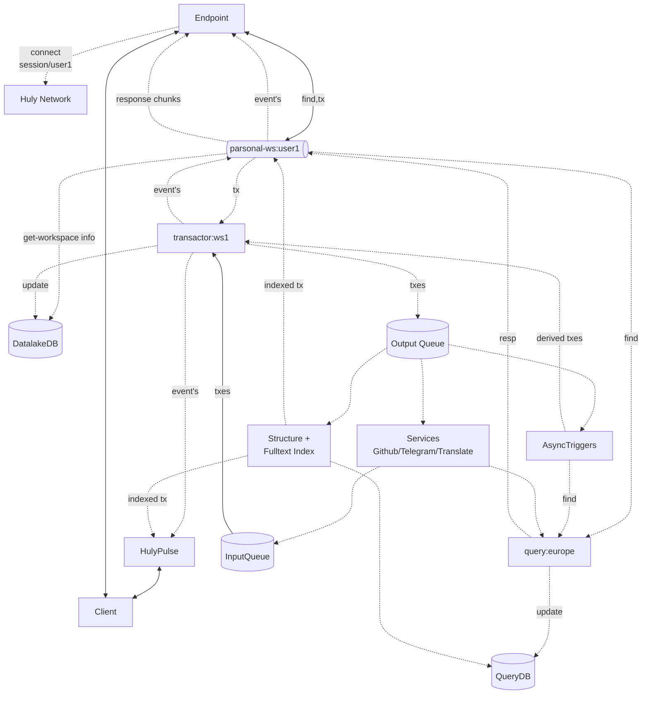

# Huly Virtual Network

A distributed, scalable virtual network architecture for the Huly that enables fault-tolerant performance communication. [Huly Network](http://github.com/hcengineering/huly.net)

## Building Huly on top of Huly Network

Huly could be managed by following set of container kinds, `session`, `query`, `transactor`.

- session -> a map/reduce/find executor for queries and transactions from client.
- query -> a DB query engine, execute `find` requests from session and pass them to DB, allow to search for all data per region. Should have access to tables of account -> workspace mapping for security.
- transactor -> modification archestrator for all edit operations, do them one by one.

